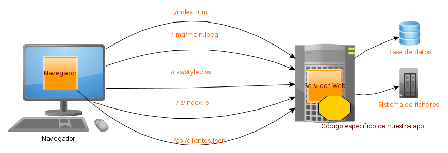

# Table of contents

- [Table of contents](#table-of-contents)
- [The web](#the-web)
- [Chrome DevTools](#chrome-devtools)
- [Deploy](#deploy)
- [Challenges ands tasks to deploy](#challenges-ands-tasks-to-deploy)
- [Deployment Tools](#deployment-tools)
- [Concepts](#concepts)
  - [IAAS vs PAAS](#iaas-vs-paas)
- [NodeJS](#nodejs)
  - [Node instalation](#node-instalation)
  - [Projects with NodeJS](#projects-with-nodejs)
  - [Programming with NodeJS](#programming-with-nodejs)
- [UniCode](#unicode)
  - [UTF-8](#utf-8)

# The web
[Up](#table-of-contents)

Webs are pages (HTML, img, JSON, XML...) interconnected by URLs.

Structure: 


The browser requests the resource to be obtained via TCP/IP. The format of how it requests that resource is through the HTTP protocol. And the TCP/IP server responds using the HTTP protocol by returning the data.

In the example we can see that the resource `/index.html` is requested. Once obtained, the browser sees that there are links to other resources that it also requests from the server:

- `/img/main.jpeg`, `/css/style.css` and `/js/index.js`: it gets them from the file system.
- `/api/clients.json`: It gets it based on the information from the database.

With all this, it displays the HTML+CSS+Image page and executes the JavaScript code on the page inside the browser.

On the server host was running the TCP/IP server that understands the HTTP protocol. We will call this software the Web server. The server is “customizable” allowing code specific to our application to be executed. That specific code is the server code that is usually written in Java, PHP, NodeJS, etc.

Therefore in a web app there are 3 types of code:
- Display code: HTML, CSS, Images, Videos, etc.
- Client-side code: The JavaScript that runs in the browser
- Code on the server: The application-specific program that runs on the web server.

Similar schema:


# Chrome DevTools
[Up](#table-of-contents)

Browsers have tools to debug the web pages. 

The most popular is Chrome DevTools. To open it, right-click on the page and select `Inspect` or press `F12`.

In 'Network' we can see the requests made by the browser to the server.

# Deploy
[Up](#table-of-contents)

Deploy is the process of moving the code from the development environment to the production environment into a web server.

# Challenges ands tasks to deploy
[Up](#table-of-contents)

- Generate the application to install:
  - Obtain the source code.
  - Compile the code.
  - Test the app.
  - Analyze the quality of the code.
- Different programs to install:
  - Operative System.
  - Web Server.
  - Database.
  - The application itself.
  - Email server.
  - Etc.
- Hosts:
  - The database can stay in one Host and the web server in another, etc.
  - Hosts can be virtual or physical machines.
  - They can be at the same or different locations and/or providers.
- Administration:
  - Backup creation.
  - Logs.
  - Sequrity: recovery in case of loss.
- Performance: allow that the app continues to work even if there is a peak of users.
  - Adding new machines if there is a peak and removing them when the peak is over.
  - Load balancing.
  - Monitoring.
  - Alerts of low performance.
- Fiability.
- Microservices: one app can be divided into several micro-applications.
  - All the previous points are multiplied by the number of microservices.

# Deployment Tools
[Up](#table-of-contents)

Tools we are goint to use in class:
- Bash scripts.
- Git.
- Dcker.
- GitHub Actions.
- NodeJS.

Other apps and services:
- Kubernetes.
- Vagrant.
- AWS.
- Ansible.
- Jenkins.

# Concepts
[Up](#table-of-contents)

- VPS (Virtual Private Server): A virtual machine that you rent from a company.
- Hosting Company: Company that rents the Host either a VPSs or a real machine.
- Load balancer: Software that receives a request and redirects it to another Host among several so as not to overload any Host or avoid sending it to a host that does not work.
- Scalability: Design the application in such a way that Hosts (VPS or real machines) are rented or unrented depending on the system load.
- Fault tolerance: Design the application in such a way that even if a host fails, the application continues to work.

- IAAS (Infrastructure as a Service): If the Hosting company only offers the Host and we have to install all the software, including the operating system and manage everything.
- PAAS (Platform as a Service): If the Hosting company offers us the Host but also generic software already installed, such as the Operating System, Web Server, Mail Server, Load Balancer, etc. In this case we only have to install the specific code of our application, in this case although they offer us a host because the app must be somewhere, they are really offering us the web server where to install our app. In the case of PAAS, we do not have to manage either the Operating System or the server.
- SAAS (Software as a Service): As developers we never use a SASS since the hosting company already offers even the installed application. An example would be Google with “Google Docs”, Microsoft with its “MS Office 365”, DropBox, etc. that already offer everything to the end user.

## IAAS vs PAAS
[Up](#table-of-contents)

IAAS is more versatile but more complex to create and manage: OS, web server, app.

PASS is easier to use but less versatile: only the app. Nevertheless, we have to stick to the software that the hosting company offers.

# NodeJS
[Up](#table-of-contents)

It is a JavaScript based programming language.

It is interpreted, not compiled.

A lot of tools for web development are written in NodeJS.

It includes a package manager called NPM.

## Node instalation
[Up](#table-of-contents)

To install NodeJS in Ubuntu:
```bash
sudo apt update
sudo apt install nodejs
sudo apt install npm
```

## Projects with NodeJS
[Up](#table-of-contents)

To create a new project with NodeJS:
```bash
mkdir my_project
cd my_project
npm init
```

Installing JQuerry:
```bash
npm install jquery
```
- It is installed in the 'node_modules' folder.

Install a global package:
```bash
npm install -g typescript
```
- A global package is installed in the system and can be used by any project.
- It is stored in 'usr/local/bin' in Linux.

Installing everything if 'node_modules' is not present:
```bash
npm install
```

## Programming with NodeJS
[Up](#table-of-contents)

We create the file 'index.js' with the following code:
```javascript
console.log("Hello World");
```

To run the code:
```bash
node index.js
```

# UniCode
[Up](#table-of-contents)

Unicode is an encoding standard that aims to allow the representation of all characters used in the world's writing systems, as well as symbols and emojis. 

Unlike ASCII (7-bit) and ANSI (8-bit), Unicode assigns each character a unique number, called a “code point” and the code points are from U+0000 to U+10FFFFFF (2,097,152 characters).

Apart from Unicode, there are other encoding standards:
- ASCII: 7-bit encoding standard.
  - It uses 128 characters.
  - It includes the English alphabet, numbers, punctuation marks, and some control characters.
  - It was developed in the 1960s.
  - It was designed to manage texts in English.
- ANSI: 8-bit encoding standard.
  - It uses 256 characters.
  - It includes the ASCII characters and some special characters.
  - It was developed in the 1980s.
  - It was designed to manage texts in English and other languages.
  - The are different ANSI standards depending on the language.

| Code Page      | ANSI              | Similar in Windows                  |
|----------------|-------------------|-------------------------------------|
| Latin 1        | ISO 8859-1         | Windows-1252 (Includes € as 0x80)   |
| Greek          | ISO 8859-7         | Windows-1253                        |
| Cyrillic       | ISO 8859-5         | Windows-1251                        |
| Latin 9        | ISO 8859-15 (Includes € as 0xA4) | -                  |

On the web, actually ISO 8859-1 is the same as Windows-1252.

## UTF-8

UTF-8 (Unicode Transformation Format - 8 bits) is a variable encoding scheme that uses between 1 and 4 bytes to represent each Unicode character.

It is highly efficient for texts in languages that use common Latin characters, as these are represented in a single byte.

UTF-8 has become the most widely used encoding on the web due to its compatibility with older systems using ASCII and its ability to encode any Unicode character.

It is also very efficient in terms of storage for most Western languages.

UTF-8 encoding:

| Code Point        | Byte 1      | Byte 2      | Byte 3      | Byte 4      |
|-------------------|-------------|-------------|-------------|-------------|
| U+0000..007F      | 0xxxxxxx    |             |             |             |
| U+0080..07FF      | 110xxxxx    | 10xxxxxx    |             |             |
| U+0800..FFFF      | 1110xxxx    | 10xxxxxx    | 10xxxxxx    |             |
| U+10000..10FFFF   | 11110xxx    | 10xxxxxx    | 10xxxxxx    | 10xxxxxx    |