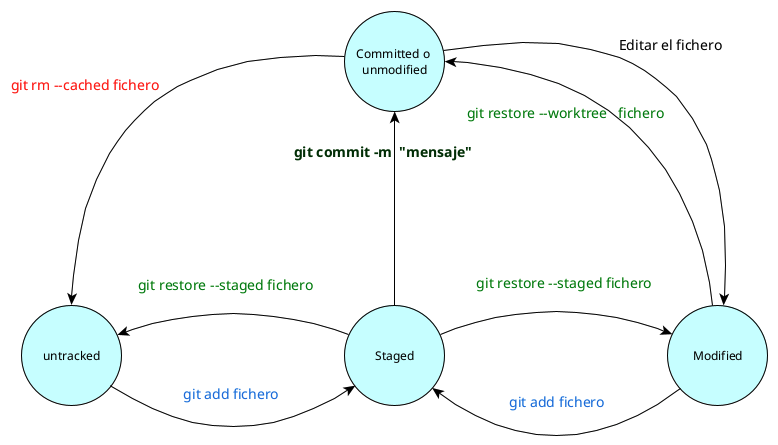
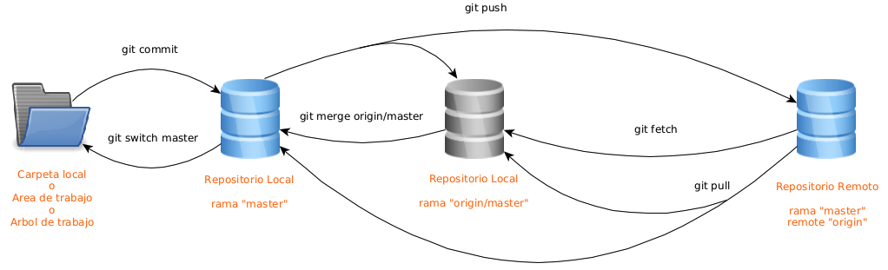
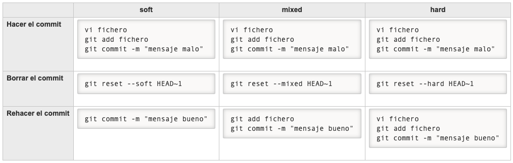

# Table of Contents

- [Table of Contents](#table-of-contents)
- [Introduction](#introduction)
- [Installing Git](#installing-git)
- [Starting a Repository](#starting-a-repository)
- [File Status Lifecycle](#file-status-lifecycle)
- [Git Sync](#git-sync)
  - [Remotes](#remotes)
- [Commit Deletion](#commit-deletion)
- [Undoing Changes](#undoing-changes)
- [Moving around the Repository](#moving-around-the-repository)
- [Configuration](#configuration)
- [Git Stash](#git-stash)
- [Log](#log)
- [Commit Messages](#commit-messages)
  - [Type](#type)
  - [#issue](#issue)
  - [Examples](#examples)

# Introduction

Important steps in Windows:
- Choosing default editor: **Vim**, Nano, Notepad++, etc.
- Adjusting PATH environment: Use Git and optional Unix tools from the Windows Command Prompt (the one with the warning).
- Choose the default behavior of `git pull`: Only even fast-forward.
  - To change it in Linux: `git config --global pull.ff only`.
```bash
git config --global core.editor "vim"
                                git config --global pull.ff only
```
- Path of `git config` global in Linux: `~/.gitconfig`

The rest is `Next`.

# Installing Git
[Up](#table-of-contents)

- Last version in Linux:
```bash
sudo add-apt-repository ppa:git-core/ppa
sudo apt update
sudo apt install git
```
- Name and email:
```bash
git config --global user.name "juan"
git config --global user.email juan@micorreo.com
```

# Starting a Repository
[Up](#table-of-contents)

- To start a directory as a repository:
```bash
git init
```
- To clone a repository:
```bash
git clone <url>
```

# File Status Lifecycle
[Up](#table-of-contents)



- `untracked` files: These are files that exist in the workspace but do not exist for git.
- `staged` or changes to be committed: These are modified files that will be added to the next commit.
- `committed`: These are files that were saved in the last commit and have not been modified since that commit.
- `modified` or changes not tracked for commit: These are files that have been modified since the last commit but have not yet been added for the next commit.

Aquí tienes la tabla con los datos solicitados:

| Command        | `--cached` | `--staged` |
|----------------|----------|----------|
| **`git rm`**     | ✓        |          |
| **`git restore`**|          | ✓        |
| **`git diff`**   | ✓        | ✓        |


- `git restore` in the staging area does not work. It only works in the working directory. It is used to restore a file to the last commit.
  - To restore a file in the staging area, you need to use `git restore --staged <file>`.
  - `git restore` in an untracked file does not work.
- `git rm --cached <file>` removes a file from the committed area but keeps it in the working directory. 
  - It is useful when you want to stop tracking a file but keep it in your working directory.
  - If you want to delete it permanently, you can use `git rm <file>`.
  - If you want to delete it permanently from the command line, you can use `git rm <file> -f`.
- `git commit -m "message"` commits the changes in the staging area.
- `git add <file>` adds a file to the staging area.
- `git commit -a -m "message"` commits all changes in the working directory and the staging area.
- `git status` shows the status of the files in the working directory and the staging area.
- `git stash` is used to save the current state of the working directory and the staging area. It is useful when you want to switch branches without committing your changes.
  - `git stash push` is the same as `git stash`.
  - `git stash push --all` stashes all changes, including untracked files.
- To see the list of remotes:

```bash
git remote -v

origin	https://github.com/lgonzalezmislata/prueba.git (fetch)
origin	https://github.com/lgonzalezmislata/prueba.git (push)
```

- To add a remote:

```bash
git remote add otroservidor https://www.otroservidor.com/lgonzalezmislata/prueba.git
```


| Command                               | Restores in the working area | Restores in the staged area |
|---------------------------------------|------------------------------|-----------------------------|
| `git restore file`                    | ✓                            |                             |
| `git restore --staged file`           |                              | ✓                           |
| `git restore --worktree file`         | ✓                            |                             |
| `git restore --staged --worktree file`| ✓                            | ✓                           |

# Git Sync
[Up](#table-of-contents)



- `origin`: is the name of the URL of the remote repository.
- `origin/master` is the name of a branch of ourselves that we one on local.
- `origin master` is the name of a branch of the remote repository.
- `git merge --ff-only origin master` does not have sense. It should be `git merge --ff-only origin/master`.
  - You cannot merge to the branch of a different server.

## Remotes
[Up](#table-of-contents)

To see the list of remotes:

```bash
git remote -v

origin	https://github.com/lgonzalezmislata/prueba.git (fetch)
origin	https://github.com/lgonzalezmislata/prueba.git (push)
```

To add a new remote:

```bash
git remote add nombreminuevoremote https://www.otroservidor.com/lgonzalezmislata/prueba.git
```

# Commit Deletion
[Up](#table-of-contents)

- `git reset <commit>` deletes the commit and the changes in the working directory.
  - `git reset --soft <commit>` deletes the commit but keeps the changes in the working directory.
  - `git reset --mixed <commit>` deletes the commit and the changes in the staging area.
  - `git reset --hard <commit>` deletes the commit and the changes in the working directory.
- If we want to delete the last commit, we can use `git reset HEAD~1`.



# Undoing Changes
[Up](#table-of-contents)

- `git revert <commit>` creates a new commit that undoes the changes of the specified commit.
- `git revert HEAD~1` undoes the last commit.
- `git revert --no-commit HEAD~1` undoes the last commit but does not create a new commit.
  - Useful because it allows us to review what the commit is going to do and allows us to make any further modifications.
  - If we are not interested in doing the commit we can abort it with `git revert --abort` or use the already known `git restore --staged --worktree file`.
  - Finally, to commit everything we can use `git commit -m "message"` or `git commit -am "message"`.

> **Note**: The `--no-commit` option is useful because it allows us to review what the commit is going to do and allows us to make some more modifications. if we are not interested in doing the commit we can abort it with `git revert --abort` or use the already known `git restore --staged --worktree file`.
> In case of a conflict, you must resolve the conflict in the file, do the `git add <file>` and finally commit.
> The difference between `git revert` and `git reset` is that `git revert` creates a new commit that undoes the work of another commit, while `git reset` actually deletes the commits.

# Moving around the Repository
[Up](#table-of-contents)

- `git switch <branch>` changes the branch.
- `git switch --detach origin/develop` changes to the remote branch `develop`.
  - We need to use `--detach` because we cannot create a commit in that branch.
- `git switch --detach <commit hashcode>` changes to the commit.
  - Its utility is to review the changes in that commit.

# Configuration
[Up](#table-of-contents)

- `.gitignore` is a file that contains the files that we do not want to track. It is useful for files that are generated automatically.
  - It has to be created in the root of the repository.
  - Example inside `.gitignore`:
  ```css
  /node_modules
  /* This ignores the node_modules directory */
  ```
- .gitkeep is a file that is used to keep a directory in the repository.
  - It is useful when we want to keep a directory but we do not have any file to add.
- Storing passwords
  - `git config --global credential.helper cache` stores the password for 15 minutes.
  - `git config --global credential.helper store` stores the password permanently.

# Git Stash
[Up](#table-of-contents)

- `git stash` is used to save the current state of the working directory and the staging area.
  - `git stash push` is the same as `git stash`.
  - `git stash push --all` stashes all changes, including untracked and ignored files.
  - `git stash --include-untracked` stashes all changes, including untracked files.
- `git stash pop` applies the last stash.
  - `git stash pop --index` applies the last stash and keeps the changes in the staging area.

# Log
[Up](#table-of-contents)

- `git log` shows the history of the commits.
  - `git --no-pager log --pretty=oneline` shows the history of the commits in one line.
- View the commits indicating which fields we want to show and indicating the format of the date:
  - `git --no-pager log --pretty=tformat:"%h %cn %cd %s" --date=format:"%d/%m/%Y %H:%M:%S"`
- Other options:
  - `git log --oneline` shows the history of the commits in one line.
  - `git log --graph` shows the history of the commits in a graph.
  - `git log --graph --oneline` shows the history of the commits in a graph in one line.
  - `git log --oneline --all` shows the history of the commits in one line of all branches.
  - `git log --oneline --all --decorate` shows the history of the commits in one line of all branches with the names of the branches.
  - `git log --oneline --all --decorate --graph` shows the history of the commits in one line of all branches with the names of the branches in a graph.

# Commit Messages
[Up](#table-of-contents)

Format:
```
type(#issue):titulos

Explicación (opcional)
```

## Type
[Up](#table-of-contents)

- `feat`: If a new feature is added
- `fix`: If a bug is fixed
- `docs`: If you only change things in the documentation
- `style`: If you only change the style of the code such as tabs, semicolons, formatting, etc.
- `refactor`: If you change the code to improve its quality but without changing the functionality. This is called refactoring.
- `test`: If you change things related to automatic tests.
- `chore`: If you change things related to deployment.

## #issue 
[Up](#table-of-contents)

Is the number of the issue to which it refers. More information about GitHub issues: [here](https://docs.github.com/en/issues/tracking-your-work-with-issues/about-issues).

## Examples
[Up](#table-of-contents)

Fixed bug 45 called “Failure if date is empty”.
  
  ```
  fix(#45): Failure if date is empty
  ```

New functionality called “Show patient list” is added with No. 456
    
    ```
    feat(#456): Show patient list

    El listado se ha hecho en HTML en vez de generar un PDF.
    ```
