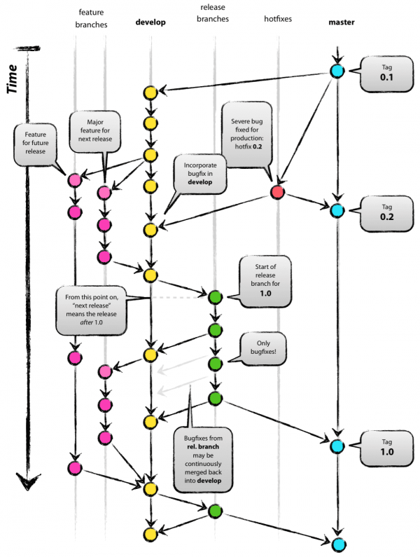
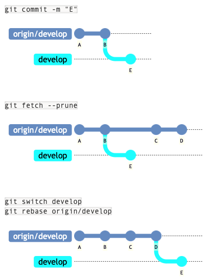
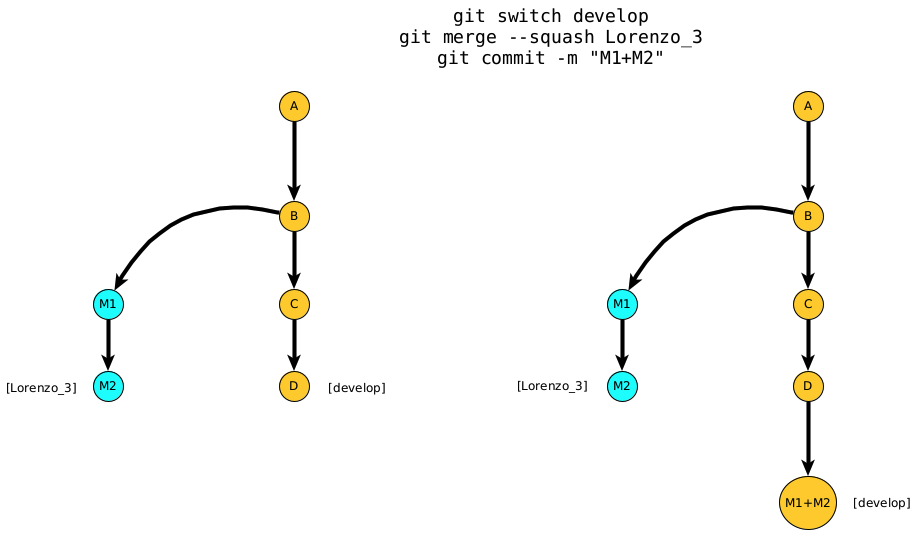
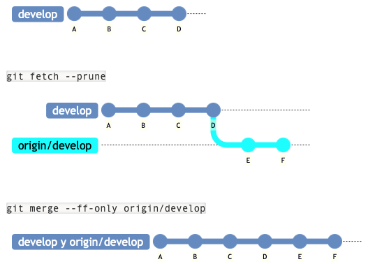
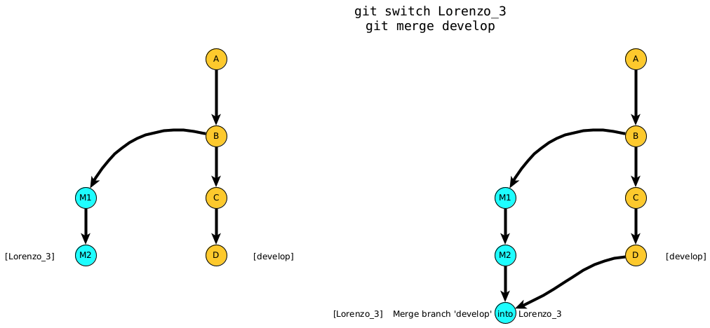

# Table of contents
- [Table of contents](#table-of-contents)
- [Branch necessities](#branch-necessities)
- [Using branches](#using-branches)
- [Merge](#merge)
  - [`git rebase rama`](#git-rebase-rama)
  - [`git merge --squash rama`](#git-merge---squash-rama)
  - [`git merge --ff-only rama`](#git-merge---ff-only-rama)
  - [`git merge rama`](#git-merge-rama)
- [Merge uses](#merge-uses)
- [Conflicts](#conflicts)
  - [`git rebase`](#git-rebase)
  - [`git merge --squash`](#git-merge---squash)
  - [`git merge --ff-only`](#git-merge---ff-only)
  - [`git merge`](#git-merge)
- [Receipts](#receipts)

# Branch necessities
[Up](#table-of-contents)



Branches to create:
- `master`: main branch, production-ready
- `develop`: development branch, where all the features are merged
- `feature/feature-name`: branch for a new feature
- `release/vX.Y.Z`: branch for a new release

Steps to create a new branch:
1. Create the branch `feature`from `develop`
2. Make the task with every commit you need
3. Merge the branch `develop`to `feature`
4. Go to `develop`and merge `feature`with `git merge --squash`
5. Delete the branch `feature`
6. Upload the branch `develop`to the remote repository
7. Merge `develo`in `release`
8. Merge `release`in `master` and upload it to the remote repository

# Using branches
[Up](#table-of-contents)

Create a new branch and uploading it to the remote repository:
```bash
git branch nuevaRama
git switch nuevaRama
git push --set-upstream origin nuevaRama
git push -u             origin nuevaRama
```

Download a branch from the remote repository:
```bash
git fetch --prune   
git switch nuevaRama
```
We use `--prune`to delete the branches that are not in the remote repository
By default, `switch`downloads the branch from the remote repository (`--track`to `origin/nuevaRama`)

Delete a branch that has been merge or uploaded to the remote repository:
```bash
git branch -d miRama
git branch --delete miRama
```

Delete a local branch that has NOT been merge or uploaded to the remote repository:
```bash
git branch -d -f      miRama
git branch --delete --force miRama
git branch -D         miRama
```

Delete a remote branch:
```bash
git push origin --delete miRama
```

# Merge
[Up](#table-of-contents)

Here is the translated table:

| Command                   | Characteristics                                                                 | When to use it                                                                                                    |
|---------------------------|---------------------------------------------------------------------------------|-------------------------------------------------------------------------------------------------------------------|
| `git rebase branch`        | Reorders the commits in the new branch, placing them after the existing ones.    | To apply the commits from `origin/develop` to `develop` when both have different commits originating from the same point. |
| `git merge --squash branch`| Combines all the "microcommits" from the branch into a single commit in the destination branch. A commit is required afterward. | From a feature branch to `develop`.                                                                                |
| `git merge --ff-only branch`| Never creates new commits in the destination branch, but fails if creating a new commit is necessary. Helps detect potential issues. | From `develop` to `release`, from `release` to `master`, or to update any branch from GitHub when no local commits exist. |
| `git merge branch`         | A regular merge that may create new commits.                                     | From `develop` to a feature branch. To resolve conflicts from the feature branch when it's acceptable to create new commits. |

## `git rebase rama`
[Up](#table-of-contents)

Puts the commits in the new branch always after the existing ones.

It is used to put the commits of `origin/develop` in `develop` before the ones in `develop`because there are different commits in each branch but from the same origin commit.

```bash
git switch develop
git rebase origin/develop
```



## `git merge --squash rama`
[Up](#table-of-contents)

Joins every 'microcommit' of the branch in only one in the destination branch. It is necessary to make a commit afterward.

It is used to merge a feature branch in `develop`.



## `git merge --ff-only rama`
[Up](#table-of-contents)

It only overtakes the pointer of the branch if it is possible. 

It never creates new commits. It fails if it is necessary creating a new commit.

It helps to detect potential issues.

It is used from `develop` to `release`, from `release` to `master`, or to update any branch from GitHub when there are no local commits.



## `git merge rama`
[Up](#table-of-contents)

It is the regular merge that may create new commits.

It is used from `develop` to a feature branch or to resolve conflicts from the feature branch when it is acceptable to create new commits.



# Merge uses
[Up](#table-of-contents)

- Download (or update) a branch (such as master, release or develop) from Github, assuming that there will be no problems. 
  - That is to say that we have not done a commit on that branch since the last time we downloaded it.
```bash
git fetch --prune
git switch develop
git merge --ff-only origin/develop
 
git fetch --prune
git switch release
git merge --ff-only origin/release
 
git fetch --prune
git switch master
git merge --ff-only origin/master
```

- Merge develop in release or release in master (assuming that both branches are updated because we have updated them with the previous commands) and that we have not made commits directly in either release or master.
```bash
git switch release
git merge --ff-only develop
 
git switch master
git merge --ff-only release
```

- Merge (rebase) the changes from origin/develop into our develop if there are different commits in develop and origin/develop.
```bash
git fetch --prune
git switch develop
git rebase origin/develop
```
  - The logical is doing a rebase when `git pull`fails.
```bash
! [rejected]        develop -> develop (fetch first)
error: falló el push de algunas referencias a 'https://github.com/usuario/repositorio.git'
ayuda: Actualizaciones fueron rechazadas porque el remoto contiene trabajo que
ayuda: no existe localmente. Esto es causado usualmente por otro repositorio 
ayuda: realizando push a la misma ref. Quizás quiera integrar primero los cambios
ayuda: remotos (ej. 'git pull ...') antes de volver a hacer push.
ayuda: Vea 'Notes about fast-forwards0 en 'git push --help' para detalles.
```

- Merge into develop from our feature branch with a single commit with --squash (We have previously updated develop from GitHub).
  - Remember doing a commit after the merge.
```bash
git switch develop
git merge  --squash lorenzo_42
git commit -am "feat(#42):pantalla de Login"
```

- Merge the changes from develop into our branch to solve the conflicts little by little (We have updated develop from GitHub before).
```bash
git switch lorenzo_42
git merge develop
```

# Conflicts
[Up](#table-of-contents)

*Notes here*

## `git rebase`
[Up](#table-of-contents)

*Notes here*

## `git merge --squash`
[Up](#table-of-contents)

*Notes here*

## `git merge --ff-only`
[Up](#table-of-contents)

*Notes here*

## `git merge`
[Up](#table-of-contents)

*Notes here*

# Receipts
[Up](#table-of-contents)

- Download the last of the 3 branches:
```bash
git fetch --prune && git switch develop && git merge --ff-only origin/develop && git switch release && git merge --ff-only origin/release && git switch master && git merge --ff-only origin/master && git switch develop
```
- Make a merge of the 3 branches:
```bash
git switch release && git merge --ff-only develop && git switch master && git merge --ff-only release && git switch develop
```
- Update the 3 branches:
```bash
git switch master && git push && git switch release && git push && git switch develop && git push
```