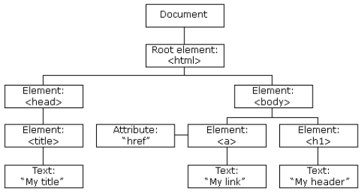
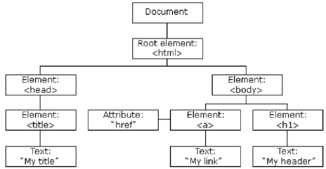
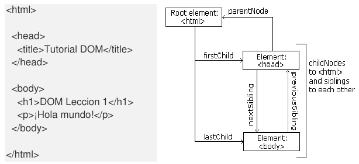
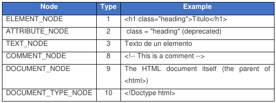

# Table of contents
- [Table of contents](#table-of-contents)
- [HTML DOM](#html-dom)
  - [What is DOM?](#what-is-dom)
  - [What is HTML DOM?](#what-is-html-dom)
- [DOM programming interface](#dom-programming-interface)
- [DOM HTML document object](#dom-html-document-object)
- [DOM Nodes](#dom-nodes)
  - [Relationship between nodes](#relationship-between-nodes)
  - [Node properties](#node-properties)
    - [Basic properties](#basic-properties)
    - [Properties of the relationship between nodes](#properties-of-the-relationship-between-nodes)
- [Finding and accessing HTML elements](#finding-and-accessing-html-elements)
  - [Accessing elements by ID](#accessing-elements-by-id)
  - [Accessing elements by tag name](#accessing-elements-by-tag-name)
  - [Accessing elements by class name](#accessing-elements-by-class-name)
  - [Accessing elements by CSS selectors](#accessing-elements-by-css-selectors)
  - [Accessing elements by HTML object collections](#accessing-elements-by-html-object-collections)
- [Modifying DOM elements](#modifying-dom-elements)
  - [Modifying the value of an attribute](#modifying-the-value-of-an-attribute)
  - [Modifying the style of an element](#modifying-the-style-of-an-element)
- [Operations on DOM nodes](#operations-on-dom-nodes)
  - [Creating new nodes](#creating-new-nodes)
  - [Deleting nodes](#deleting-nodes)
  - [Replacing nodes](#replacing-nodes)
  - [Cloning nodes](#cloning-nodes)
- [Assigning events using the DOM HTML](#assigning-events-using-the-dom-html)

# HTML DOM
[Up](#table-of-contents)

When a website loads, the browser creates the DOM (Document Object Model).
- Model: Means taht the DOM offers a structured representation of the HTML document.
- Object: Each element of the DOM is an object you can access and manipulate with JavaScript.
- Document: It refers to the HTML page.

The HTML DOM is built like a tree of objects:


JavaScript can:
- Change all the HTML elements of the website.
- Change all the attributes.
- Change all the CSS styles.
- Create new elements and attributes.
- Delete elements and attributes.
- React to all the events.
- Create new events.
>>>>>>> 295be37 (WDCE - First Evaluation: Unit 6 (first half))

## What is DOM?
[Up](#table-of-contents)

It is a W3C (World Wide Web Consortium) standard.

It is separated in 3 different parts:
- Core DOM: Standard model for all types of documents.
- XML DOM: Standard model for XML documents.
- HTML DOM: Standard model for HTML documents.

## What is HTML DOM?
[Up](#table-of-contents)

It is a standard model of objects and a programming interface for HTML.

Defines:
- HTML elements as objects.
- The properties of all HTML elements
- The methods to access to all HTML elements.
- The events of all HTML elements.

# DOM programming interface
[Up](#table-of-contents)

We can access to the HTML DOM with JS and other programming languages.

## `getElementById` method
[Up](#table-of-contents)

The most common way to access an HTML element.

```html
<html>
  <body>
    <p id="demo"></p>
    <script>
      document.getElementById("demo").innerHTML = "Hello World!";
    </script>
  </body>
</html>
```

## `innerHTML` property
[Up](#table-of-contents)

Easiest way to obtain the content of an element.

This property is useful to obtain or replace the content of HTML elements. Including `<body>` and `<html>`.

It is a shortcut to the strict methods.

# DOM HTML document object
[Up](#table-of-contents)

Finding HTML elements:
- `document.getElementById(id)`: Finds an element by id.
- `document.getEelementsByTagName(name)`: Finds elements by HTML tag.
- `document.getElements ByClassName(name)`: Finds elements by CSS class.
- `querySelector(css)`: Allows finding an element using CSS selectors.
- `querySelectorAll(css)`: Returns a collection of all the elements with that selector.

Changing HTML elements:
- `element.innerHTML = X`: Changes the HTML content of an element.
- `element.attribute = X`: Changes the value of an attribute of an HTML element.
- `element.style.property = X`: Changes the style of an HTML element.
- `element.setAttribute(attribute, value)`: It does the same as the previous one, but it has the value and the attribute as arguments.

Adding and deliting elements:
- `document.createElement(element)`: Creates an HTML element.
- `document.removeChild(element)`: Deletes an HTML element.
- `document.appendChild(element)`: Adds an HTML element.
- `document.replaceChild(new, old)`: Replaces an HTML element.
- `document.write(text)`: Writes on the HTML website.

Adding event handlers:
- `document.getElementById(id).onclick = function() {code}`: Adds an event handler to an HTML element. 
  - In this case, a function to manage the "click" on an element with that id.

# DOM Nodes
[Up](#table-of-contents)

Everything in an HTML document is a node.
- All the document is a document node.
- Each HTML element es an element node.
- The text inside the HTML elements are text nodes.
- Each HTML attribute is an attribute HTML (deprecated).
- Every comment is a comment node.



JS can access to every node of the node tree.

It can create new ones, modify or delete them.

## Relationship between nodes
[Up](#table-of-contents)

- The nodes in a tree have a hierarchical relationship.
- The superior node is the root node.
- Each node has a parent, except the root node.
- A node can have several children.
- Siblings are nodes of a same parent.



## Node properties
[Up](#table-of-contents)

### Basic properties
[Up](#table-of-contents)

- `nodeName`: Specifies the name of the node.
  - Only readable.
  - The node name of a node element is the same as the tag.
  - The node name of an attribute node is the name of the attribute.
  - The node name of a text node is always `#text`.
  - The node name of the doccument is always `#document`.

```html
<h1 id="h1">My First Page</h1>

<script>
  alert(document.getElementById("h1").nodeName);
</script>
```

`nodeName` always contains the name of the tag in upper case.

- `nodeValue`: Specifies the value of a node.
  - Only readable.
  - The node value for elements nodes is `null`.
  - The node value for text nodes is the inner text.
  - The node value for attribute nodes is the value of the attribute.
  - More important:



### Properties of the relationship between nodes
[Up](#table-of-contents)

- `parentNode`: parent node.
- `childNodes[nodeNumber]`: collection of child nodes.
- `firstChild`: first child of a node.
- `lastChild`: last child of a node.
- `nextSibling`: next sibling of a node.
- `previousSibling`: previous sibling of a node.

### Secundary nodes and values of a node

A common mistake is expecting that  a node element contains text.

```html
<p id="p1">Tutorial DOM </p>
```

The node of the `<p>` element does not contain text. It contains a text node that contains text.

We can access to the value of a node with `innerHTML`:

```javascript
let miP = document.getElementById("demo").innerHTML;
```

Accessing to the first child can be done like this:

```javascript
let miP = document.getElementById("demo").firstChild.nodeValue;
```

Or like this too:

```javascript
let miP = document.getElementById("demo").childNodes[0].nodeValue;
```

For the objects taht contain text, we can also use `textContent`.

# Finding and accessing HTML elements
[Up](#table-of-contents)

## Accessing elements by ID
[Up](#table-of-contents)

```javascript
let myElement = document.getElementById("intro");
```

If it finds the element,the method will return the element as an object. If not, it will return `null`.

## Accessing elements by tag name
[Up](#table-of-contents)

```javascript
<p>Hola mundo!</p>
<p>Como funciona <b>getElementsByTagName</b> en selecciones.</p>
<p id="p1"></p>

<script>
  let parrafos = document.getElementsByTagName("p");

  for(i=0;parrafos.length;i++)
    alert(parrafos[i].innerHTML)
</script>
```

If it finds the element(s), it returns an HTML Collection (we can not use the methods of arrays).

We can convert them with `Array.from(element)`.

### Search of child elements

***PAGE 13***

## Accessing elements by class name
[Up](#table-of-contents)

## Accessing elements by CSS selectors
[Up](#table-of-contents)

## Accessing elements by HTML object collections
[Up](#table-of-contents)

# Modifying DOM elements
[Up](#table-of-contents)

## Modifying the value of an attribute
[Up](#table-of-contents)

## Modifying the style of an element
[Up](#table-of-contents)

# Operations on DOM nodes
[Up](#table-of-contents)

## Creating new nodes
[Up](#table-of-contents)

## Deleting nodes
[Up](#table-of-contents)

## Replacing nodes
[Up](#table-of-contents)

## Cloning nodes
[Up](#table-of-contents)

# Assigning events using the DOM HTML
[Up](#table-of-contents)

