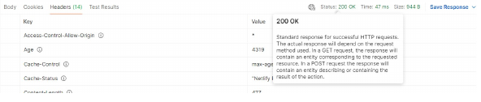

# Table of Contents
- [Table of Contents](#table-of-contents)
- [What Is an API?](#what-is-an-api)
- [REST Archiquecture](#rest-archiquecture)
- [REST API Calls](#rest-api-calls)
- [REST Clients (Postman)](#rest-clients-postman)
- [JSON-Server](#json-server)

# What Is an API?
[Up](#table-of-contents)

API: Application Programming Interface.

It is a set of routines, functions and procedures (methods) that allows using resources of a software by other software, serving as an abstraction layer or intermediary.

API REST is the successor of SOAP and WSDL, which require more resources and specifications and are more complex.

# REST Archiquecture
[Up](#table-of-contents)

REST: Representational State Transfer.

REST archiquecture works on the HTTP protocol.

Consequently, the procedures or methods are the same, mainly:
- GET.
- POST.
- PUT.
- PATCH.
- DELETE.
- Others: OPTIONS and HEAD.
  - HEAD is used to pass validation parameters, autorization, type of proccessing, etc.

Another component of an API REST IS THE `HTTP Status Code`, which is a number that indicates the status of the request.
- 200: OK.
- 201: Created.
- 304: Not Modified.
- 400: Bad Request.
- 401: Unauthorized.
- 403: Forbidden.
- 404: Not Found.
- 422: Unprocessable Entity.
- 500: Internal Server Error.

An answer of an API RESTFul would be the next:
```html
Status Code: 200 OK
Access-Control-Allow-Methods: PUT, GET, POST, DELETE, OPTIONS
Connection: Keep-Alive
Content-Length: 186
Content-Type: application/json
Date: Mon, 24 May 2016 15:15:24 GMT
Keep-Alive: timeout=5, max=100
Server: Apache/2.4.9 (Win64) PHP/5.5.12
X-Powered-By: PHP/5.5.12
access-control-allow-credentials: true
```

The body of the answer is the data that the server sends to the client.

The best option is to use JSON format, because it is easy to read and write.

REST has become in the most widely used technology in the web client/server app development.

Advantages:
- Separation between client and server.
- Visibility, fiability and scalability.
- Independence of the platform or language.

# REST API Calls
[Up](#table-of-contents)

They are generally used to make CRUD (Create, Read, Update, Delete) operations.

Each petition is implemented as an HTTP petition, which includes:
- The URL that represents the resource (http://www.example.com/api/resources).
- The HTTP method (GET, POST, PUT, PATCH, DELETE).
- The state code.

Operations:
- GET: To get data.
  - Of all the registers.
  - Of a particular register.
- POST: To create data.
- PUT: To update data & PATCH: To update data partially.
  - We must specify the URL and the id of the element to modify.
  - We must include the object with the values we want to update in the petition.
- DELETE: To delete data.
  - - We must specify the URL and the id of the element to delete.

# REST Clients (Postman)
[Up](#table-of-contents)

Characteristics:
- Follows the REST principles.
- Facilitates the communication.
- Versatile.

Steps:
1. Request of the client: Resource, HTTP method, additional data (optional).
2. Processing of the server: The server processes the request and sends the response.
3. Response of the server: HTTP status code, headers, body.
4. Interpretation of the client: The client interprets the response and shows it to the user.

Example with a GET petition to the Rick & Morty API with Postman:



# JSON-Server
[Up](#table-of-contents)

It allows building API REST in an easy and fast way.

It is used during the development proccess to test local REST petitions.

It is even used to start building the front-end petitions.

Once finished, the only thing we have to do is to change the URL of the petitions.

To initiate the JSON-Server, we must install it with the next command:
```bash
npm install -g json-server
```

Then, we must create a JSON file with the data we want to use.

Finally, we must execute the next command:
```bash
json-server --watch file.json
```

The server will be ready in the port 3000 (`http://localhost:3000`).

Characteristics:
- All the entities are stored in a JSON file.
- All the entities must have an id.
- The CRUD cchanges will be authomatics and saved in the JSON file.
- A POST, PUT or PATCH petition must includ a header `Content-Type: application/json`.

Paths:
- GET: `http://localhost:3000/entities`.
- GET: `http://localhost:3000/entities/1`.
- POST: `http://localhost:3000/entities`.
- PUT: `http://localhost:3000/entities/id`.
- PATCH: `http://localhost:3000/entities/id`.
- DELETE: `http://localhost:3000/entities/id`.

Filters:
- GET: `/posts?title=json-server&author=typicode`.
- GET: `/posts?id=1&id=2`.
- GET: ` /comments?author.name=typicode`.
