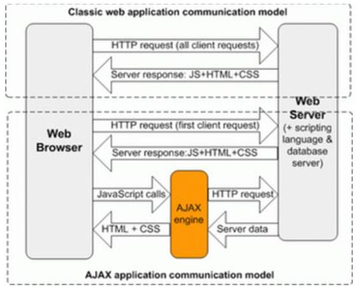
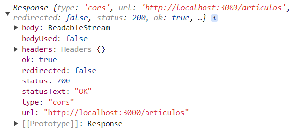
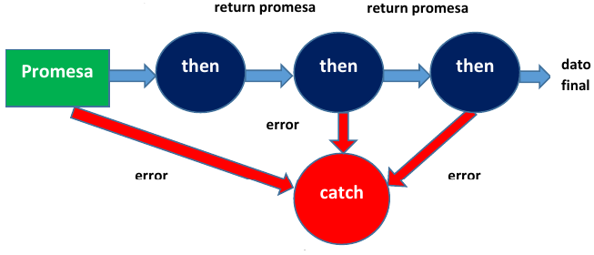

# Table of Contents

- [Table of Contents](#table-of-contents)
- [Asynchronous Communication in JavaScript](#asynchronous-communication-in-javascript)
- [AJAX](#ajax)
  - [XMLHttpRequest Object](#xmlhttprequest-object)
  - [GET Petition](#get-petition)
  - [DELETE Petition](#delete-petition)
  - [Sending Data to the Server (POST, PUT and PATCH)](#sending-data-to-the-server-post-put-and-patch)
- [Promises](#promises)
  - [Then](#then)
  - [Catch](#catch)
  - [Fetch](#fetch)
    - [GET Petition](#get-petition-1)
    - [DELETE Petition](#delete-petition-1)
    - [Sending Data to the Server (POST, PUT and PATCH)](#sending-data-to-the-server-post-put-and-patch-1)
    - [POST Petition](#post-petition)
    - [PUT Petition](#put-petition)
  - [Promises Enchainment](#promises-enchainment)
  - [Refactoring](#refactoring)
- [Async / Await](#async--await)

# Asynchronous Communication in JavaScript
[Up](#table-of-contents)

Asynchronous communication has become a key feature in modern web development. 

It allows the program to continue executing code while waiting for a response from the server. This is important because it allows the user to continue interacting with the application while the server is processing the request.

It means that the different tasks are not executed one after the another, but they are executed at the same time or in parallel.

This is thanks to JavaScript, taht allows the browser executes code in a non-blocking way.

Advantages:
- Improves user experience: the interface does not freeze while waiting for a response from the server.
- Increases scalability: the server can handle more requests at the same time.
- Simplifies the code: the code is easier to read and maintain.

Problems:
- Managing multiple asynchronous requests can be complex, because each petition will finish in an undetermined time and, almost sure, they will finish in a different order than they were sent.
- We can have asynchronous petitions that depend on the result of another petition.
- Maybe we want to execute a code after all the petitions have finished.

Use cases:
- Loading data: when we need to load data, it can be loaded asynchronously to avoid blocking the interface.
- API REST petitions: when we need to send or receive data from a server.
- Real time chat.
- Online games.

Mechanisms:
- Callbacks.
- Promises.
- Async / Await.

Indepently, behind all of them is AJAX.

# AJAX
[Up](#table-of-contents)

AJAX (Asynchronous JavaScript and XML) is a technique that allows the browser to communicate with the server without having to reload the page.

This includes HTML, CSS, JavaScript, DOM, XML, XSLT and, most importantly, the XMLHttpRequest object.

When these technologies are combined in the AJAX model, web applications can update the content of a page without reloading the page.

Comparison os the classic model and the AJAX model:


## XMLHttpRequest Object
[Up](#table-of-contents)

The fundamental object in AJAX is the `XMLHttpRequest` object.

The basic functionality is the next:
1. Create an instance of the `XMLHttpRequest` object.
```javascript
let xhr = new XMLHttpRequest();
```
2. Initialize the object.
```javascript
xhr.open(method, URL, [async, user, password]);
```
- `method`: the HTTP method to use.
- `URL`: the URL to send the request.
- `async`: a boolean value that indicates if the request should be asynchronous or not. By default, it is `true`.
  - `true`: the request is asynchronous.
  - `false`: the request is synchronous.
- `user` and `password`: the username and password to use for authentication.
- `open` does not send the request. It only initializes the request.
3. Send the petition to the server.
```javascript
xhr.send([body]);
```
- This method sends the request to the server.
- `body`: the body of the request.
  - It is optional.
  - `GET`and `DELETE` petitions do not have a body.
  - `POST`, `PUT` and `PATCH` petitions have a body to send data to the server.
4. Wait for the response.
- Most used events:
  - `load`: the request has finished successfully.
    - Even if the status code is not 200, the request has finished successfully.
    - The response is downloaded completely.
```javascript
xhr.onload = function() {
  alert(`Loaded: ${xhr.status} ${xhr.statusText}`);
}
```
  - `error`: the request has failed.
    - Inaccessible server.
    - Network error.
    - Invalid URL.
```javascript
xhr.onerror = function() {
  alert(`Error: ${xhr.status} ${xhr.statusText}`);
}
```
  - `progress`: the request is in progress.
5. Process the response.
- Once the server has responded, we can receive the result in the next properties:
  - `status`: the status code of the response (200, 201, 404...).
  - `statusText`: the status text of the response (OK for 200, Not Found for 404...).
  - `response`: the response of the server.
    - We can use `responseText` to get the response in different formats:
      - "" (default): the response is a string.
      - "text": the response is a string.
      - "json": the response is a JSON object.
      - "blob": the response is a Blob object.
      - "document": the response is a XML Document object (it can use XPath and other XML methods).
      - "arraybuffer": the response is an ArrayBuffer object.
```javascript
xhr.responseType = "json";
```

Complete petition:
```javascript
lñet xhr = new XMLHttpRequest();
xhr.open(method, URL, [async, user, password]);
xhr.responseType = "json";
xhr.send([body]);

xhr.onload = function() {
  alert(`Loaded: ${xhr.status} ${xhr.statusText}`);
  }

// Error in the petition
xhr.onerror = function() {
  alert(`Error: ${xhr.status} ${xhr.statusText}`);
}
```

## GET Petition
[Up](#table-of-contents)

We are going to do a GET petition with the Rick and Morty API.

We want to get all the characters, so the endpoint is `https://rickandmortyapi.com/api/character`.

```javascript
let xhr = new XMLHttpRequest();
xhr.open("GET", "https://rickandmortyapi.com/api/character", true);
xhr.responseType = "json";
xhr.send();

xhr.onload = function() {
  if (xhr.status == 200) {
    console.log(xhr.response);
  } else {
    console.error("Error in the petition");
  }
}

xhr.onerror = function() {
  console.error("Error in the petition");
}
```


## DELETE Petition
[Up](#table-of-contents)

We want to delete the character with the ID of a prompt, so the endpoint is `https://localhost:3000/articulos/?`, where ? is the number of the prompt.

```javascript
const url = "https://localhost:3000/articulos";

function deleteCharacter() {
  let id = prompt("Enter the ID of the character to delete");
  let xhr = new XMLHttpRequest();
  
  xhr.open("DELETE", `${url}/${id}`, true);
  xhr.responseType = "json";
  xhr.send();

  xhr.onload = function() {
    if (xhr.status == 200) {
      console.log(xhr.response);
    } else {
      console.error("Error in the petition. The article has not been deleted.");
    }
  }

  xhr.onerror = function() {
    console.error("Error in the petition");
  }
}
```

## Sending Data to the Server (POST, PUT and PATCH) 
[Up](#table-of-contents)

As we are sending data to the server, we need to specify which type it is.

For that, we must use the HTTP header, using the `setRequestHeader(name, value)` method.

The JSON format and the UTF-8 encoding are the most used.

```javascript
setRequestHeader("Content-Type", "application/json; charset=utf-8");
```

In our API, to add an article, we must use the POST method:

```javascript
const url = "https://localhost:3000/articulos";

function postArticulo() {
  let id = prompt("Enter the ID of the article to add");
  let nombre = prompt("Enter the name of the article to add");
  let precio = parseInt(prompt("Enter the price of the article to add"));

  let articulo = JSON.stringify({
    id: id,
    nombre: nombre,
    precio: precio
  });

  let xhr = new XMLHttpRequest();

  xhr.open("post", url);
  xhr.setRequestHeader("Content-Type", "application/json; charset=utf-8");
  xhr.send(articulo);

  xhr.onload = function() {
    if (xhr.status == 201) {
      console.log("El artículo se ha añadido correctamente");
    } else {
      console.error("Error en la petición. El artículo no se ha añadido.");
    };

    xhr.onerror = function() {
      alert("Error en la petición");
    }:
  }
}
```

In our API, to modify an article, we must use the PUT method.

```javascript
const url = "https://localhost:3000/articulos";

function putArticulo() {
  let id = prompt("Enter the ID of the article to modify");
  let nombre = prompt("Enter the new name of the article");
  let precio = parseInt(prompt("Enter the new price of the article"));

  let articulo = JSON.stringify({
    id: id,
    nombre: nombre,
    precio: precio
  });

  let xhr = new XMLHttpRequest();
  xhr.open("PUT", `${url}/${id}`, true);
  xhr.setRequestHeader("Content-Type", "application/json; charset=utf-8");
  xhr.send(articulo);

  xhr.onload = function() {
    if (xhr.status == 200) {
      console.log("The article has been modified correctly");
    } else {
      console.error("Error in the petition. The article has not been modified.");
    };

    xhr.onerror = function() {
      alert("Error in the petition");
    };
  }
}
```

# Promises
[Up](#table-of-contents)

XMLHttpRequest works with callbacks (we pass a function to manage the petition). It is easy for easy petitions, but the problem comes when we have to manage nested petitions.

We should launch the next petition in the onload of the first one.

This is call a Callback Hell of Pyramid of Doom:
```javascript
a(function (resultrsFromA) {
  b(resultrsFromA, function (resultrsFromB) {
    c(resultrsFromB, function (resultrsFromC) {
      d(resultrsFromC, function (resultrsFromD) {
        e(resultrsFromD, function (resultrsFromE) {
          f(resultrsFromE, function (resultrsFromF) {
            console.log(resultrsFromF);
          });
        });
      });
    });
  });
});
```

Promises are a way to manage asynchronous code in a more elegant way.

They were introduced in ES6.

A promise is an object that represents the ending or failing of an asynchronous operation.

The majority of developers use promises already created.

Characteristics:
- Asynchronous.
- Ended:
  - Fulfilled: the operation has been completed successfully.
  - Rejected: the operation has failed.

Why it is useful:
- Asynchronous code manage: it is easier to manage asynchronous code.
- Operation enchainment.
- Better readability.

States of the Promise object:
- Pending: the operation has not finished yet.
- Fulfilled: the operation has been completed successfully
  - It will be managed by the `then` method.
- Rejected: the operation has failed.
  - It will be managed by the `catch` method.

## Then
[Up](#table-of-contents)

It is the method that allows us manage the fulfilled state of the promise.

Syntax:
```javascript
prmise.then( function(result) {
    // Code to manage the result
  }, function(error) {
    // Code to manage the error
  }
);
```

The most common us using the fat arrow function:
```javascript
promise.then(result => {
    // Code to manage the result
  }, error => {
    // Code to manage the error
  }
);
```

## Catch
[Up](#table-of-contents)

It is the method that allows us manage the rejected state of the promise.

Syntax:
```javascript
promise.catch( function(error) {
    // Code to manage the error
  }
);
```

The most common us using the fat arrow function:
```javascript
promise.catch(error => {
    // Code to manage the error
  }
);
```

## Fetch
[Up](#table-of-contents)

Fetch is a modern API that allows us to make AJAX requests in a more elegant way.

It is the standard way to make AJAX requests.

Why it is useful:
- It is easier to use than XMLHttpRequest.
- Promises are used by default.
- Flexibility: it allows customizing the request with different HTTPS methods, headers and bodies.

With Fetch we will no longer use directly the XMLHttpRequest object since fetch is an API that manages the HTTP request through promises. Fetch is in charge of creating, configuring and sending the HTTP request and will return the result of the request that we will manage with the methods `then` and `catch`.

The function `fetch()`accepts two parameters:
- The URL of the resource to fetch.
- The options to configure the request (optional).

The `fetch()`function returns a promise:
- If the request is successful, the promise will be fulfilled: it will call the `then()` method.
- If the request fails, the promise will be rejected: it will call the `catch()`method.

```javascript
fetch("url", {})
  .then(responde => {
    // Code to manage the response
  })
  .catch(error => {
    // Code to manage the error
  });
```

The method `.catch()`can be ommited. It is used only when `fetch`can not connect to the server.

### GET Petition
[Up](#table-of-contents)

Syntax:

```javascript
let url='http://localhost:3000/articulos'

fetch(url, {})
  .then(response => console.log(respuesta))
  .catch(error => console.log("Network error"));
```

The result is:



The promise returns a Response object, including the following properties:
- `status`: the status code of the response (200, 404, 500...).
- `statusText`: the status text of the response (OK, Not Found, Internal Server Error...).
- `headers`: the headers of the response. They provide additional information about the responde (content type, encoding...).
- `body`: the body of the response. 
  - It is a readable stream that allows us to read the content of the response. 
    - It can be a json object, a blob, a text, a form data, an array buffer or a readable stream.
    - To access to them, we use the methods `json()`, `blob()` and `text()`, respectively.
- `ok`: a boolean value that indicates if the response is successful (status code between 200 and 299).

With the `json()` method, we can get the response in JSON format.

```javascript
let url = "http://localhost:3000/articulos";

fetch(url, {})
  .then(response => response.json())
  .then(articulos => console.log(articulos))
  .catch(error => console.log("Network error"));
```

If we want a specific article, we can use the next code:

```javascript
let url = "http://localhost:3000/articulos/2";

fetch(url, {})
  .then(response => response.json())
  .then(articulo => console.log(articulo))
  .catch(error => console.log("Network error"));
```

If we want to check the errors:

```javascript
let url='http://localhost:3000/articulos/5'

fetch(url,{})
  .then(response => {
    if (!response.ok) {
    throw new Error(`Mi Error ${response.status} ${response.statusText}`);
    }
    return response.json();
  })
  .then(articulo => console.log(articulo))
  .catch(error => alert(error))
```

If we access to a non-existing article, we will get the next error:


### DELETE Petition
[Up](#table-of-contents)

Syntax:
```javascript
let url = "http://localhost:3000/articulos/2";

fetch(url, {
  method: "DELETE"
})
  .then(response => {
    if (!response.ok) {
      throw new Error(`My Error ${response.status} ${response.statusText}`);
    }
    return response.json();
  })
  .then(articulo => console.log(articulo))
  .catch(error => alert(error));
```

In this case, we have deleted the article with id 2. Json-server will return am empty object.

### Sending Data to the Server (POST, PUT and PATCH) 
[Up](#table-of-contents)

These petitions send an object to the server.

Additionally, as we are sending information, we must specify the type of the content with an HTTP header.

### POST Petition
[Up](#table-of-contents)

Steps:
1. Indicate the URL of the resource.
2. Indicate the POST method.
3. Stablish the header `Content-Type: application/json`.
4. Convert the object to a string with `JSON.stringify()`.

Example:

```javascript
let url='http://localhost:3000/articulos'

let id=prompt("Dime el id: ")
let nombre=prompt("Dime el nombre: ")
let precio=parseInt(prompt("Dime el precio: "))

let articuloNuevo=JSON.stringify({"id":id,"nombre":nombre,"precio":precio})

let opciones={method: 'POST',
headers: {'Content-Type': 'application/json'},
body: articuloNuevo
}

fetch(url,opciones)
  .then(response => {
    if (!response.ok) {
      throw new Error(`Mi Error ${response.status} ${response.statusText}`);
    }
    return response.json();
  })
  .then (articulo => console.log(articulo))
  .catch(error => alert(error))
```
If the object is inserted, we will return the inserted object.

If the object already exists, we will return an error (`Error 500: Duplicated id`).

### PUT Petition
[Up](#table-of-contents)

Steps:
1. Indicate the URL of the resource.
2. Indicate the PUT method.
3. Stablish the header `Content-Type: application/json`.
4. Convert the object to a string with `JSON.stringify()`.

Example:

```javascript
let url='http://localhost:3000/articulos'

let id=prompt("Dime el id del registro a modificar: ")
let nombre=prompt("Dime el nuevo nombre: ")
let precio=parseInt(prompt("Dime el nuevo precio: "))

let articuloMod=JSON.stringify({"id":id,"nombre":nombre,"precio":precio})

let opciones={method: 'PUT',
  headers: {'Content-Type': 'application/json'},
  body: articuloMod
  }

fetch(url + "/" + id, opciones)
  .then(response => {
    if (!response.ok) {
    throw new Error(`Mi Error ${response.status} ${response.statusText}`);
  }
  return response.json();
  })
  .then (articulo => console.log(articulo))
  .catch(error => alert(error))
```

If the object is modified, json-server will return the modified object.

If the object does not exist, json-server will return an error (`Error 404: Not Found` with that id).

## Promises Enchainment
[Up](#table-of-contents)

If we want to access to the data of an article that a provider sells, we must do two petitions: one to access the data of the provider and another to access the data of the article.

Furthermore, the second petition must be done when the first petition has finished.

Structure:

```javascript
let url='http://localhost:3000/'

let idProveedor=prompt("Dime el id del proveedor: ")

fetch(url + "proveedores" + "/" + idProveedor)
  .then(response => {
    if (!response.ok) {
      throw new Error(`Error proveedor ${response.status} ${response.statusText}`);
    }
    return response.json();
  })
  .then(p => {console.log(p)
    fetch(url + "articulos" + "/" + p.idArticulo)
      .then(response => {
        if (!response.ok) {
          throw new Error(`Error articulo ${response.status} ${response.statusText}`);
        }
        return response.json();
      })
      .then(a=>console.log(a))
      .catch(error=>alert(error))
  })
  .catch(error => alert(error))
```



Example:

```javascript
let url='http://localhost:3000/'

let idProveedor=prompt("Dime el id del proveedor: ")

fetch(url + "proveedores" + "/" + idProveedor)
  .then(response => {
    if (!response.ok) {
      throw new Error(`Error proveedor ${response.status} ${response.statusText}`);
    }
    return response.json();
  })
  .then(p => {console.log(p)
    return fetch(url + "articulos" + "/" + p.idArticulo)
      .then(response => {
        if (!response.ok) {
          throw new Error(`Error articulo ${response.status} ${response.statusText}`);
        }
        return response.json();
      })
    })
  .then(a=>console.log(a))
  .catch(error => alert(error))
```

Each petition returns the data to the next `then` method. If an error appears in one of the petitions, the `catch` method will be executed.

## Refactoring
[Up](#table-of-contents)

We are going to encapsulate the `fetch` petitions in functions.

In this way, we can use the petition every time we need it.

Function to do the GET petitions to an article entity:

```javascript
function getArticulo(id){
  return fetch(url+"articulos"+"/"+id)
    .then(response => {
      if (!response.ok) {
        throw new Error(`Error en articulo ${response.status} ${response.statusText}`);
      }
    return response.json()
  });
}
```

This functions accepts an `id` as a parameter and, if the petition is successful, it returns the JSON object.

As the function returns directly a promise, we can call and manage it as a promise. The call would be like this:

```javascript
getArticulo(2)
  .then(articulo => console.log(articulo))
  .catch(error => alert(error));
```

We could do the same for providers:
  
```javascript
function getProveedor(id) {
  return fetch(url + "proveedores" + "/" + id)
    .then(response => {
      if (!response.ok) {
        throw new Error(`Error en proveedor ${response.status} ${response.statusText}`);
      }
      return response.json();
    });
}

// The call would be like this:
getProveedor(1)
  .then(proveedor => console.log(proveedor))
  .catch(error => alert(error));
```

We can also make the nested petition to obtain the data of an article that sells a provider:

```javascript
getProveedor(1)
  .then(proveedor => {
    console.log(proveedor);
    return getArticulo(proveedor.idArticulo);
  })
  .then(articulo => console.log(articulo))
  .catch(error => alert(error));
```

With refactoring we could design our own functions passing the parameters we need to implement the utilities of our application. 

For example, we could further refactor our example and design a single function to be able to access any entity and any object within it. In this case we should implement a function called for example getEntity that accepts two parameters, the entity and the id.

```javascript
function getEntidad(entidad,id){
  return fetch(url + entidad + "/" + id)
    .then(response => {
      if (!response.ok) {
      throw new Error(`error en ${entidad} con id ${id} ${response.status} ${response.statusText}`);
      }
      return response.json()
    });
}
```

# Async / Await
[Up](#table-of-contents)

Introduced in ES8.

Are nothing more than a form of syntactic sugar to manage promises in a way that is more similar to what we are used to.

We can manage promises, but there are some important changes:
- We do not enchain the promises with `then` 
- We do not have `catch`.
- We abandon the no blocking code.

The functioning of `async` / `await` is based in the blocking of the code until the promise is fulfilled or rejected.

We can get the articles like this:

```javascript
let url = "http://localhost:3000/articulos";

const response = await fetch(url);
const articulos = await response.json();
console.log(articulos);
```

This code will return an error because we can not use `await` outside an `async` function.

We can solve the code like this:

```javascript
let url = "http://localhost:3000/articulos";

async function getArticulos() {
  const response = await fetch(url);
  const articulos = await response.json();
  console.log(articulos);
}
```

If we want to get a specific article:

```javascript
let url = "http://localhost:3000/articulos";

async function getArticulo(id) {
  const response = await fetch(url + "/" + id);
  const articulo = await response.json();
  console.log(articulo);
}
```

If we put the id of a non-existing article, we will get an error 404, but have not managet it from the code. In order to do that, we must use a `try` / `catch` block:

```javascript
let url = "http://localhost:3000/articulos";

async function getArticulo(id) {
  try {
    const response = await fetch(url + "/" + id);
    if (!response.ok) {
      throw new Error(`Error ${response.status} ${response.statusText}`);
    }
    const articulo = await response.json();
    console.log(articulo);
  } catch (error) {
    alert(error);
  }
}
```

We can have an enchained petition like this:

```javascript
async function gtArticuloProveedor() {
  let ur = "http://localhost:3000/";
  let idProveedor = prompt("Dime el id del proveedor: ");

  // Petition for the provider
  try {
    let response = await fetch(url + "proveedores" + "/" + idProveedor);
    if (!response.ok) {
      throw new Error(`Error proveedor ${response.status} ${response.statusText}`);
    }
    let proveedor = await response.json();

    // Petition for the article
    response = await fetch(url + "articulos" + "/" + proveedor.idArticulo);
    if (!response.ok) {
      throw new Error(`Error articulo ${response.status} ${response.statusText}`);
    }
    let articuo = await response.json();
    console.log(articulo);
  } catch (error) {
    alert(error);
  }
}
```
