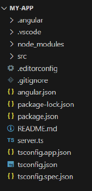
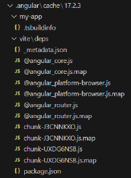
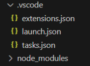
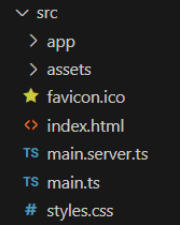
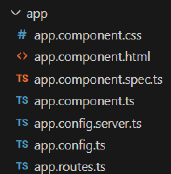

UNIT 01 - BASIC CONCEPTS

# Table of Contents
- [Table of Contents](#table-of-contents)
- [What is Angular](#what-is-angular)
- [Angular Alternatives](#angular-alternatives)
- [Installation of Angular](#installation-of-angular)
- [Creation and Execution of an Angular Project](#creation-and-execution-of-an-angular-project)
- [Live Reload](#live-reload)
- [Scaffold of an Angular Project](#scaffold-of-an-angular-project)
  - [Root of the Project](#root-of-the-project)
  - [`.angular` Folder](#angular-folder)
  - [`.vscode` Folder](#vscode-folder)
  - [`node_modules` Folder](#node_modules-folder)
  - [`src` Folder](#src-folder)
    - [`app` Folder](#app-folder)
    - [`assets` Folder](#assets-folder)
- [Producton Mode](#producton-mode)

# What is Angular
[Up](#table-of-contents)

- JavaScript framework built with TypeScript.
- Open Source.
- Maintained by Google.
- To build Single Page Applications (SPA).

Advantages:
- Modularity: Facilitates the organization and maintenance of the code.
- Routing: Facilitates the navigation between different sections of the application.
- Data Binding: Facilitates the synchronization between the view and the model.
- Directives: Facilitates the creation of custom HTML elements and the modification of the behaviour of the HTML elements.
- Dependency Injection: Facilitates the organization of the code and the reuse of components.
- Testing: Facilitates the creation of unit tests and end-to-end tests.

As a platform, Angular includes:
- A model based in components to create scalable web applications.
- A library collection that covers the most common tasks.
- A toolset to facilitate the development, testing and deployment of applications.

# Angular Alternatives
[Up](#table-of-contents)

- React: Developed by Facebook.
- Vue.js: Developed by Evan You.

# Installation of Angular
[Up](#table-of-contents)

1. Install [Node.js](https://nodejs.org/en/).
2. Install Angular CLI:
```bash
npm install -g @angular/cli
```
3. To know your version:
```bash
ng --version
```

Main functions of the Angular CLI:
- Initiate a new project.
- Generate components, services, directives, pipes, etc.
- Develope locally.
- Build and optimize the project for production.
- Execute unitary and end-to-end tests.

# Creation and Execution of an Angular Project
[Up](#table-of-contents)

```bash
ng new my-app
```

This creates the basic structure and installs the necessary dependencies and packages.

The CLI includes a server:
```bash
ng serve --open
```

The option `--open` opens the browser automatically.

We can also use `npm start` because it is included in the `package.json` file.

```json
"scripts": {
"ng": "ng",
"start": "ng serve",
"build": "ng build",
"watch": "ng build --watch --configuration development",
"test": "ng test",
"serve:ssr:my-app": "node dist/my-app/server/server.mjs"
}
```

# Live Reload
[Up](#table-of-contents)

The server is configured to reload the page automatically when a change is detected in the code.

# Scaffold of an Angular Project
[Up](#table-of-contents)

It is the folders structure of the project created by the Angular CLI with the `ng new`.



## Root of the Project
[Up](#table-of-contents)

- `angular.json`: Configuration file of the Angular CLI.
- `package.json`: Configuration file of the project and used dependencies.
- `package-lock.json`: Lock file of the dependencies.
- `README.md`: Documentation of the project.
- `server.ts`: Server file for the Angular Universal. It only apperas if the project is created with the SSR (Server Side Rendering) option.
- `tsconfig.json`: Configuration file of TypeScript.
- `tsconfig.app.json`: Configuration file of TypeScript for the application.
- `tsconfig.spec.json`: Configuration file of TypeScript for the tests.

## `.angular` Folder
[Up](#table-of-contents)



We can find:
- `my-app`: This folder contains the file `tsbuildinfo`, that is used by the TypeScript compiler to store the information of the project.
- `vite`: It is a frontend building tool known by its experience in fast development. It is used to build the project in production mode.

## `.vscode` Folder
[Up](#table-of-contents)



This folder contains the configuration files for Visual Studio Code.

## `node_modules` Folder
[Up](#table-of-contents)


This is an essential component for the management of the Node.js proyects' dependencies.

It allows us using external libraries and facilitates the organization and maintenance of our code.

It usually has a large size and a lot of files.

It is recommended ignoring this folder in the version control system.

## `src` Folder
[Up](#table-of-contents)



One of the most important folders of the project.

It is where the code of the application is located.

Includes the next subfolders and assets:
- `fav.icon`: Icon of the application.
- `index.html`: Main HTML file of the application.
- `main.ts`: Main file of the application.
- `main.server.ts`: Main file of the application for the server side rendering (SSR).
- `styles.css`: Main CSS file of the application.

### `app` Folder
[Up](#table-of-contents)

Inside the `src` folder, we can find the `app` folder.



It is where the components, services, directives, pipes, etc. are located.

It is the main folder of the application.

It is where the components are defined. Initially, it contains the `app.component.ts` file.

For each component, a folder is created with the following files:
- `component.ts`: Component file.
- `component.html`: Template file.
- `component.css`: Style file.
- `component.spec.ts`: Test file.

Additionally, it inclues:
- `app.config.spec.ts`: Used for the SSR.
- `app.config.ts`: Used fot the BootStraping.
- `app.routes.ts`: Used for the routing.

### `assets` Folder 
[Up](#table-of-contents)

Inside the `src` folder, we can find the `assets` folder.

It is where the static files are located.

They are not processed by Angular during the build.

# Producton Mode
[Up](#table-of-contents)

Angular allows us to build the project in production mode and, when it is finished, generate the necessary files for the execution in our Web Server.

To build the project in production mode:
```bash
ng build
```

It generates the `dist` folder with the necessary files.