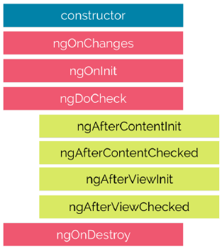
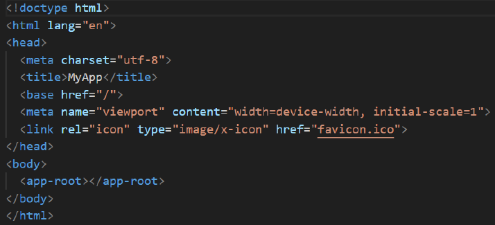

UNIT 02 - MODULES AND COMPONENTS

# Table of Contents
- [Table of Contents](#table-of-contents)
- [Modules](#modules)
- [Components](#components)
  - [Controller](#controller)
  - [View](#view)
  - [Creation of a Component](#creation-of-a-component)
  - [Use of a Component](#use-of-a-component)
  - [Lifecycle of a Component](#lifecycle-of-a-component)
- [Burst Process](#burst-process)

# Modules
[Up](#table-of-contents)

It is a class with the decorator `@NgModule`.

A decorator is a special function that allows us to define the metadata of the module (compoenents, directives, pipes...).

Decorators are put before the class definition.

Modules are essential for the organization of the code in blocks.

They are containers to storage the components, directives, pipes, services, etc.

Example:


From 17th version it is recommended tu use the `standalone` mode, which do not need modules.

When we create a module with `ng g m module_name`, the module is created with the `standalone` mode.

We will have the next file:
```typescript
import { NgModule } from '@angular/core';
import { CommonModule } from '@angular/common';

@NgModule({
    declarations: [],
    imports: [CommonModule]
})
export class Modulo1Module { }
```

# Components
[Up](#table-of-contents)

They are basic blocks for the development of Angular applications.

They have a visual part (HTML) and a logical part (TypeScript).

## Controller
[Up](#table-of-contents)

Components are TypeScript classes with the decorator `@Component`.

```typescript
import { Component } from '@angular/core';
import { RouterOutlet } from '@angular/router';

@Component({
    selector: 'app-root',
    standalone: true,
    imports: [RouterOutlet],
    templateUrl: './app.component.html',
    styleUrl: './app.component.css'
})
export class AppComponent {
    title = 'my-app';
}
```

The components define new HTML tags in order to be used in other components.

They have to import the elements they are going to used. In this case, the `RouterOutlet` element and the `Component` one.

The decorator has the next properties:
- `selector`: Name of the tag that will be used in the HTML.
- `standalone`: It is used to indicate that the component is independent and does not need to be imported in a module.
- `imports`: It is used to import the elements that are going to be used in the component.
- `templateUrl`: Path to the HTML file.
- `styleUrl`: Path to the CSS file.

## View
[Up](#table-of-contents)

The view is the HTML part of the component.

We can also use the data binding and the Angular directives.

Here we define the visual strcutre of the used component:
- HTML template.
- Data links that connect the component properties with the HTML template.
- Directives that add functionalities to the template.

When a component is created, Angular includes the minimum HTML show to ensure that it works.

## Creation of a Component
[Up](#table-of-contents)

We can create a component with the Angular CLI:
```bash
ng g c component_name
```

It is a good practice to include the folder where the component is going to be created:
```bash
ng g c folder/component_name
```

Here we create *componente1* and *componente2* in the folder *Components*:
```bash
ng g c Components/componente1
ng g c Components/componente2
```

We will have the next structure:


## Use of a Component
[Up](#table-of-contents)

The component `app.component` is the one who initializes the application.

Particularities:
- Its name is AppComponent.
- Its selector is `app-root`.
- It is destined to be the main component of the application in the `index.html`.

## Lifecycle of a Component
[Up](#table-of-contents)

The lifecycle of a component has 8 stages:


- `ngOnChanges`: It is executed when detects a change in the properties of the entrace of a component.
- `ngOnInit`: It is executed once, after the comoonent has been initiated and the properties have been stablert.
- `ngDoCheck`: It is executed after each change detection, what allows persoalized checkings.
- `ngAfterContentInit`: It is executed once, after the content of the component (child components) has been initialized.
- `ngAfterContentChecked`: It is executed after each change detection, what allows persoalized checkings.
- `ngAfterViewInit`: It is executed once, after the view of the component (DOM) has been initialized.
- `ngAfterViewChecked`: It is executed after each change detection in the view of the component.
- `ngOnDestroy`: It is executed once, before the component is destroyed, what allows cleaning tasks.

Each stage is associated with a `hook` (special method) that we can implement in our component.

Those hooks allow executing code in specific moments of the lifecycle of the component.

- `ngOnChanges`: 
  - This event is executed each time a value of a control input changes inside of a component.
  - It is activated first when a value of a linked property changed.
  - It always receives a `change data map` with the previous and the current value of the property.
- `ngOnInit`:
  - Once Angular has deployed the `data-bound properties` or when the component has been initiated. (once `ngOnChanges` has been executed).
  - This event is mainly used to initialize the data of the component.
- `ngDoCheck`:
  - It is executed after the entry properties of a component are verified.
  - This method implements our own logic or algorithm of personalized changes detection for any component.
- `ngAfterContentInit`:
  - It is executed when Angular does any content projection in the component.
  - It is executed once after all component links have been verified.
  - It is linked  with the initialize of the child component.
- `ngAfterContentChecked`:
  - It is executed after method `ngAfterViewInit` and every time the vew of the componen verifies changes.
  - It is also exexuted when every link of the secondary directives has been modified.
  - Very useful when the component awaits any value that comes from its secondary components.
- `ngOnDestroy`: 
  - This method is executed just before Angular destroys the components.
  - Very useful to deregister observables and disconnect event handlers to avoid memory leaks.

If we want to use those hooks, we must implement the `ts` file of the component:
```typescript
import { Component } from '@angular/core';

@Component({
    selector: 'app-componente1',
    standalone: true,
    imports: [],
    templateUrl: './componente1.component.html',
    styleUrl: './componente1.component.css'
})
export class Componente1Component {
    constructor(){
        console.log("Se ejecuta constructor")
    }
ngOnInit(){
    console.log("Se ejecuta ngOnInit")
}
}
```

# Burst Process
[Up](#table-of-contents)

From Angular 17th version, the burst is done indicating in the `main.ts` whitch component initializes the application.

```typescript
import { bootstrapApplication } from '@angular/platform-browser';
import { appConfig } from './app/app.config';
import { AppComponent } from './app/app.component';

bootstrapApplication(AppComponent, appConfig)
    .catch(err => console.error(err));
```

And adding that component to the `index.html`:


