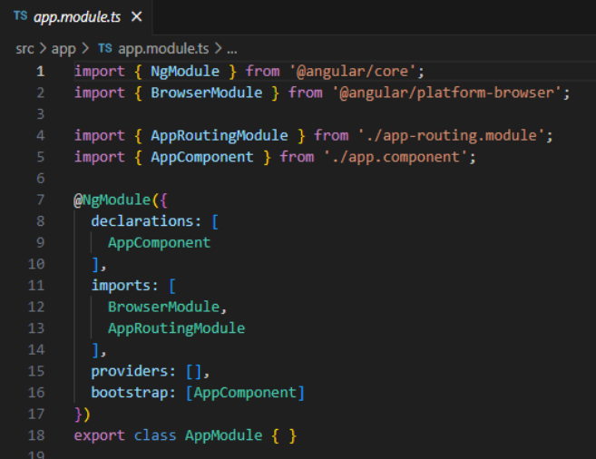
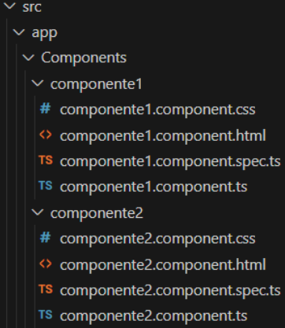

UNIT 02 - MODULES AND COMPONENTS

# Table of Contents
- [Table of Contents](#table-of-contents)
- [Modules](#modules)
- [Components](#components)
  - [Controller](#controller)
  - [View](#view)
  - [Creation of a Component](#creation-of-a-component)
  - [Use of a Component](#use-of-a-component)
  - [Lifecycle of a Component](#lifecycle-of-a-component)
- [Burst Process](#burst-process)

# Modules
[Up](#table-of-contents)

It is a class with the decorator `@NgModule`.

A decorator is a special function that allows us to define the metadata of the module (compoenents, directives, pipes...).

Decorators are put before the class definition.

Modules are essential for the organization of the code in blocks.

They are containers to storage the components, directives, pipes, services, etc.

Example:


From 17th version it is recommended tu use the `standalone` mode, which do not need modules.

When we create a module with `ng g m module_name`, the module is created with the `standalone` mode.

We will have the next file:
```typescript
import { NgModule } from '@angular/core';
import { CommonModule } from '@angular/common';

@NgModule({
    declarations: [],
    imports: [CommonModule]
})
export class Modulo1Module { }
```

# Components
[Up](#table-of-contents)

They are basic blocks for the development of Angular applications.

They have a visual part (HTML) and a logical part (TypeScript).

## Controller
[Up](#table-of-contents)

Components are TypeScript classes with the decorator `@Component`.

```typescript
import { Component } from '@angular/core';
import { RouterOutlet } from '@angular/router';

@Component({
    selector: 'app-root',
    standalone: true,
    imports: [RouterOutlet],
    templateUrl: './app.component.html',
    styleUrl: './app.component.css'
})
export class AppComponent {
    title = 'my-app';
}
```

The components define new HTML tags in order to be used in other components.

They have to import the elements they are going to used. In this case, the `RouterOutlet` element and the `Component` one.

The decorator has the next properties:
- `selector`: Name of the tag that will be used in the HTML.
- `standalone`: It is used to indicate that the component is independent and does not need to be imported in a module.
- `imports`: It is used to import the elements that are going to be used in the component.
- `templateUrl`: Path to the HTML file.
- `styleUrl`: Path to the CSS file.

## View
[Up](#table-of-contents)

The view is the HTML part of the component.

We can also use the data binding and the Angular directives.

Here we define the visual strcutre of the used component:
- HTML template.
- Data links that connect the component properties with the HTML template.
- Directives that add functionalities to the template.

When a component is created, Angular includes the minimum HTML show to ensure that it works.

## Creation of a Component
[Up](#table-of-contents)

We can create a component with the Angular CLI:
```bash
ng g c component_name
```

It is a good practice to include the folder where the component is going to be created:
```bash
ng g c folder/component_name
```

Here we create *componente1* and *componente2* in the folder *Components*:
```bash
ng g c Components/componente1
ng g c Components/componente2
```

We will have the next structure:


## Use of a Component
[Up](#table-of-contents)

The component `app.component` is the one who initializes the application.

Particularities:
- Its name is AppComponent.
- Its selector is `app-root`.
- It is destined to be the main component of the application in the `index.html`.

## Lifecycle of a Component
[Up](#table-of-contents)

# Burst Process
[Up](#table-of-contents)

