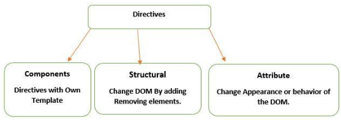

UNIT 04 - DIRECTIVES

# Table of Contents
- [Table of Contents](#table-of-contents)
- [Directives](#directives)
- [Directive Types in Angular](#directive-types-in-angular)
  - [Component Directives](#component-directives)
  - [Attribute Directives](#attribute-directives)
  - [Structural Directives](#structural-directives)
    - [`ngIf` and `@if`](#ngif-and-if)
      - [`ngIf` Directive](#ngif-directive)
      - [`@if` Directive](#if-directive)
    - [`ngSwitch` and `@switch`](#ngswitch-and-switch)
      - [`ngSwitch` Directive](#ngswitch-directive)
      - [`@switch` Directive](#switch-directive)
    - [`ngFor` and `@for`](#ngfor-and-for)
      - [`ngFor` Directive](#ngfor-directive)
      - [`@for` Directive](#for-directive)

# Directives
[Up](#table-of-contents)

When we develop an application with Angular, it is pretty usual to use directives.

Directives are instructions in the DOM that tell Angular to do something to a DOM element.

They are easy to read and easy to add.

They are a way to extend HTML with new attributes or elements:
- Modify the structure of the DOM: Adding, manipulating or deleting from the view.
- Modify the general aspect: Modigy classes, create properties, etc.

# Directive Types in Angular
[Up](#table-of-contents)



## Component Directives
[Up](#table-of-contents)

These are special directives used to create reusable code blocks with their own HTML template, logic and styles. 

Component Directives are directives with a Template. 

Components have `@Component` decorators, the component is a `@Directive` decorator that is extended with template features.

They are subdivided into:
- Angular Directives: `@Component`, `@Module`, etc.
- Personalized Directives: Created with `ng g directives [name]`.

## Attribute Directives
[Up](#table-of-contents)

They are used as HTML attributes.

They modify the DOM, but without creating nor deleting the HTML element itself.

They are formed by:
- `[ngStyle]`: Allow change the properties of the selected element.
- `[ngClass]`: Allow to add or remove classes to the selected element.
- `[ngModel]`: Allow creating the two-way data binding.

## Structural Directives
[Up](#table-of-contents)

They are used to modify the structure of the DOM and the HTML element itself.

They allow analizing a condition and iterating over a list of elements.

They are the next ones:

### `ngIf` and `@if`
[Up](#table-of-contents)

They allor show or hide an element depending on a condition.

#### `ngIf` Directive
[Up](#table-of-contents)

We must include first the `CommonModule` in the controller.

```typescript
import { CommonModule } from '@angular/common';
import { Component } from '@angular/core';

@Component({
    selector: 'app-ejemplo-if',
    standalone: true,
    imports: [CommonModule],
    templateUrl: './ejemplo-if.component.html',
    styleUrl: './ejemplo-if.component.css'
})

export class EjemploIfComponent {
}
```

Then, we can use the `ngIf` directive in the HTML file.

It works like this:
```html
<elemento *ngIf=”condición”>…</elemento>
```

We are going to show or hide a `div`according to a variable. The variable will be defined in the controller with an innitial value of `true`.

```typescript
isLogged:boolean = true;
```

Then, we are going to use the `ngIf` directive in the HTML file.

```html
<h2>Directiva *ngIf</h2>

<!-- Ejemplo simple con condición -->
<div class="alert alert-danger" role="alert" *ngIf=
"isLogged">
A simple primary alert—check it out!
</div>
```

The div will be shown because the value of `isLogged` is `true`.

In order to do different things, we can use the `else` statement.

```html
<elemento *ngIf=”condición; else plantilla”>…</elemento>
<ng-template #plantilla>
HTML
</ng-template>
```

We modify the HTML file to include the `else` statement.

```html
<div class="alert alert-success" role="alert" *ngIf=
"isLogged; else
noLogged">
    El usuario esta logueado
</div>

<ng-template #noLogged>
    <div class="alert alert-danger" role="alert">
        El usuario no esta logueado
    </div>
</ng-template>
```

#### `@if` Directive
[Up](#table-of-contents)

From Angular 17.

More similar to JavaScript.

Syntax:
```html
@if(condición){
    HTML (true)
}@else{
    HTML (false)
}
```

Previous example with `@if` directive.

```html
@if (isLogged) {
    <div class="alert alert-success" role="alert" *ngIf=
"isLogged">
        El usuario esta logueado
    </div>
}@else {
    <div class="alert alert-danger" role="alert">
        El usuario no esta logueado
    </div>
}
```

### `ngSwitch` and `@switch`
[Up](#table-of-contents)

#### `ngSwitch` Directive
[Up](#table-of-contents)

Syntax:
```html
<elemento [ngSwitch]=”variable”>
    <elemento *ngSwitchCase=”valor1”> HTML 1</elemento>
    <elemento *ngSwitchCase=”valor2”> HTML 2</elemento>
    <elemento *ngSwitchCase=”valorn”> HTML n</elemento>
    <elemento *ngSwitchDefault”> HTML otro valor</elemento>
</elemento>
```

Example depending on the value of a variable called `number`.

```html
Numero <input type="number" size="3" [(ngModel)]=
"numero" id="number">

<div [ngSwitch]=
"numero">
    <div *ngSwitchCase=
"1">Uno</div>
    <div *ngSwitchCase=
"2">Dos</div>
    <div *ngSwitchCase=
"3">Tres</div>
    <div *ngSwitchDefault class="alert alert-danger">Fuera de [1-3]</div>
</div>
```


#### `@switch` Directive
[Up](#table-of-contents)

From Angular 17.

More similar to JavaScript.

Syntax:
```html
@switch(variable){
    @case(valor1){
        HTML 1
    }
    @case(valor2){
        HTML 2
    }
    @case(valorn){
        HTML n
    }
    @default{
        HTML otro valor
    }
}
```

Example using the previous one:
```html
@switch(numero){
    @case(1){
        <div>Uno</div>
    }
    @case(2){
        <div>Dos</div>
    }
    @case(3){
        <div>Tres</div>
    }
    @default{
        <div class="alert alert-danger">Fuera de [1-3]</div>
    }
}
```

### `ngFor` and `@for`
[Up](#table-of-contents)

They allow iterating over a list of elements.

#### `ngFor` Directive
[Up](#table-of-contents)

Syntax:
```html
<elemento *ngFor=”let item of items”>
    HTML {{item}}
</elemento>
```

Functioning:
1. We define a variable that contains the collection of data to iterate.
2. We use the `*ngFor` directive to iterate over the collection.
3. We indicate the variable to iterate inside the `*ngFor` directive.
4. We define the HTML block that will be rendered for each element of the collection.

Example using the array "Articulos" of the class "Articulo".

```typescript
import { Component } from '@angular/core';
import { ARTICULOS } from '../Modelos/articulo';

@Component({
    selector: 'app-ejemplo-for',
    standalone: true,
    imports: [],
    templateUrl: './ejemplo-for.component.html',
    styleUrl: './ejemplo-for.component.css'
})

export class EjemploForComponent {
    articulos=ARTICULOS
}
```

```html
<ul>
    <ng-container *ngFor=
"let articulo of articulos2">
        <li>{{ articulo.nombre }}</li>
    </ng-container>
    <ng-container *ngIf=
"articulos2.length === 0">
        <div class="alert alert-danger">No hay articulos</div>
    </ng-container>
</ul>
```

>Note: The `*ngIf` directive is used to show a message when the array is empty.

>Note: The `ng-container` directive is used to group elements without adding an extra element to the DOM (Angular only allows using one structural directive per element).

#### `@for` Directive
[Up](#table-of-contents)

From Angular 17.

More similar to JavaScript.

Includes the property mandatory `track`, which is used to track the changes in the array.

It also includes `@empty` to show a message when the array is empty.

Syntax:
```html
@for (item of items; track item.id) {
    <elemento> {{ item }} </elemento>
}
@empty {
    HTML ítems vacio
}
```

Previous example with `@for` directive.

```html
<ul>
    @for(articulo of articulos; track articulo.id){
        <li> {{articulo.nombre}}</li>
    }
    @empty {
        <div class="alert alert-danger">No hay articulos</div>
    }
</ul>
```

