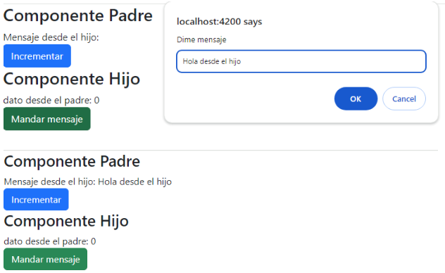

UNIT 05 - COMPONENT COMMUNICATION

# Table of Contents
- [Table of Contents](#table-of-contents)
- [Component Nesting](#component-nesting)
- [Communication Father-Son](#communication-father-son)
- [Communication Son-Father](#communication-son-father)
- [Bidirectional Communication](#bidirectional-communication)

# Component Nesting
[Up](#table-of-contents)

With Angular, we can nest components within each other. This is a powerful feature that allows us to create complex applications with ease.

We have seen previously how to nest components with the main app component (`AppComponent`). We import the component and put the tag in the HTML file.

```html
<app-header></app-header>
```

```typescript
import { Component } from '@angular/core';
import { RouterOutlet } from '@angular/router';
import { HeaderComponent } from './Components/header/header.component';

@Component({
    selector: 'app-root',
    standalone: true,
    templateUrl: './app.component.html',
    styleUrl: './app.component.css',
    imports: [RouterOutlet,HeaderComponent]
})

export class AppComponent {

}
```

However, in this case there is not communication between the components.

In the majority of cases, we will need to communicate and to send information between the components.

# Communication Father-Son
[Up](#table-of-contents)

In this case, the father component will call the son component and will send information to it.

We use the Property Binding to send information from the father to the son.

Syntax:
```html
<etiqueta-hijo [dato]=”valor”></etiqueta-hijo>
```

What we are doing is calling the son component passing the value of the property `dato`.

To receive que data in the son component, we use the `@Input` decorator, that allows us to receive the data from the father component.

If we want to send tha numer 100 from the father to the son, we do the following:

- Father component
```html
<h3>Componente Padre</h3>
<app-hijo [dato]=
"100"></app-hijo>
````
- Son component

```typescript
import { Component, Input } from '@angular/core';

@Component({
    selector: 'app-hijo',
    standalone: true,
    imports: [],
    templateUrl: './hijo.component.html',
    styleUrl: './hijo.component.css'
})

export class HijoComponent {
    @Input() dato!:number
}
```


>Note: The `!` is used to indicate that the variable will be initialized later.


```html
<h3>Componente Hijo</h3>
dato desde el padre: {{dato}}
```

We can modify the app to send the value of a variable that can change its value from the father and the son will receive the new value.

- Father component
```typescript
import { Component } from '@angular/core';
import { HijoComponent } from '../hijo/hijo.component';

@Component({
    selector: 'app-padre',
    standalone: true,
    imports: [HijoComponent],
    templateUrl: './padre.component.html',
    styleUrl: './padre.component.css'
})

export class PadreComponent {
    variable:number=0
    
    incrementar(){
        this.variable++
    }
}
```

```html
<h3>Componente Padre</h3>

<button class="btn btn-primary" (click)=
"incrementar()">Incrementar</button>

<app-hijo [dato]=
"variable"></app-hijo>
```

The son component does not need to be modified.

Result:


# Communication Son-Father
[Up](#table-of-contents)

This type of communication is more complex.

In order to solve this problem, we use the `@Output` decorator and `EventEmitter` to create personalized events that will be listened by the father component.

Syntax:
```html
<etiqueta-hijo (eventoPersonalizado)=”metodoPadre($event)”> </etiqueta-hijo>
```
- `eventoPersonalizado` is the name of the event that will be listened by the father component.
- `metodoPadre($event)` is the father method that will be executed from the son. The `$event` variable will contain the data sent by the son to the father.

To use the decorator in the son component, we need to import the `Output` element and the `EventEmitter` class.

```typescript
import { EventEmitter, Output } from '@angular/core';
```

Once imported, we can creat the personalized event:

```typescript
@Output() eventoPersonalizado = new EventEmitter<string>();
```

What we are doing is to define a custom event that will be called `eventoPersonalizado` that when it happens will return a string value in the event variable. Now in any method of the child controller we will be able to make that event happen, what we do is to emit the event.

```typescript
metodoHijo(value:string){
    this.eventoPersonalizado.emit(value);
}
```

In this case there is a method in the child called `metodoHijo` that receives a parameter called `value` of type `string`. Inside this method the event `eventoPersonalizado` is launched, passing it as parameter the string type value data as defined in the decorator `@Output`.

Once the event is launched, the father component will be able to listen to it.

```html
<etiqueta-hijo (eventoPersonalizado)=”metodoPadre($event)”> </etiqueta-hijo>
```

The `metodoPadre` would be lik this:

```typescript
metodoPadre(value:string){
    alert(value);
}
```

Complete example:
- Son component
```typescript
import { Component, EventEmitter, Input, Output } from '@angular/core';

@Component({
    selector: 'app-hijo',
    standalone: true,
    imports: [],
    templateUrl: './hijo.component.html',
    styleUrl: './hijo.component.css'
})

export class HijoComponent {
    @Input() dato!:number
    
    @Output() mandaMensaje=new EventEmitter<string>

    mensaje(){
        let mensaje:string | null
        mensaje=prompt("Dime mensaje")
        if (mensaje==null){
            mensaje=""
        }
        this.mandaMensaje.emit(mensaje)
}
}
```

```html
<h3>Componente Hijo</h3>
dato desde el padre: {{dato}}
<br>
<button class="btn btn-success" (click)=
"mensaje()">Mandar mensaje</button>
```

- Father component
```typescript
import { Component } from '@angular/core';
import { HijoComponent } from '../hijo/hijo.component';

@Component({
    selector: 'app-padre',
    standalone: true,
    imports: [HijoComponent],
    templateUrl: './padre.component.html',
    styleUrl: './padre.component.css'
})

export class PadreComponent {
    variable:number=0
    mensaje:string=""

    incrementar(){
        this.variable++
    }

    muestraMensaje(dato:string){
        this.mensaje=dato
    }
}
```

```html
<h3>Componente Padre</h3>
Mensaje desde el hijo: {{mensaje}}
<br>
<button class="btn btn-primary" (click)=
"incrementar()">Incrementar</button>
<app-hijo [dato]=
"variable"
(mandaMensaje)=
"muestraMensaje($event)" >
</app-hijo>
```

Everytime we click the button in the son component, a prompt will appear asking for a message. Once the message is written, it will be sent to the father component and will be displayed in the father component.

Result:


# Bidirectional Communication
[Up](#table-of-contents)

It is very common to need to send information from the father to the son and vice versa.

For example, to show data of a collection in a child component with a `@for`and from the child to make operations that send data to the father.

In these cases, we will use the two methods seen previously.

Schema:


Example with `Articulos` where the card will be the son.

1. We create the commponents `cards`(father) and `card`(son).
```bash
ng g c /Components/cards
ng g c /Components/card
```
2. Father HTML
```html
<h2>Comunicación Padre-Hijo con *ngFor Bidereccional</h2>

<div id="contenedor" class="row row-cols-1 row-cols-md-6 g-4">
    @for(articulo of articulos; track articulo.id){
        <app-card [articulo]=
"articulo"
(borrarArticulo)=
"borrar($event)">
        </app-card>
    } @empty {
        <div class="alert alert-danger" role="alert">
            No hay articulos
        </div>
    }
</div>
```
3. Father TypeScript
```typescript
import { Component } from '@angular/core';
import { ARTICULOS, Articulo } from '../../Modelos/articulo';
import { CardComponent } from '../card/card.component';

@Component({
    selector: 'app-cards',
    standalone: true,
    imports: [CardComponent],
    templateUrl: './cards.component.html',
    styleUrl: './cards.component.css'
})

export class CardsComponent {
    articulos:Articulo[]=ARTICULOS
    
    borrar(id:string){
        let pos = this.articulos.findIndex(a => a.id == id)
        this.articulos.splice(pos,1)
    }
}
```
4. Son HTML
```html
<div class="card">
    
    <div class="card-body">
        <h5 class="card-title">{{articulo.nombre}}</h5>
        <p class="card-text">{{articulo.descripcion}}</p>
        <b><p class="card-text text-center">{{articulo.precio}}</p></b>
        <div class="card-text text-center">
            <button (click)=
"borrar(articulo.id)" class="btn btn-danger">
                Borrar
            </button>
        </div>
    </div>
</div>
```
5. Son TypeScript
```typescript
import { Component, EventEmitter, Input, Output } from '@angular/core';
import { Articulo } from '../../Modelos/articulo';

@Component({
    selector: 'app-card',
    standalone: true,
    imports: [],
    templateUrl: './card.component.html',
    styleUrl: './card.component.css'
})

export class CardComponent {
    @Input () articulo!:Articulo
    @Output() borrarArticulo=new EventEmitter<string>

    borrar(id:string){
        this.borrarArticulo.emit(id)
    }
}
```