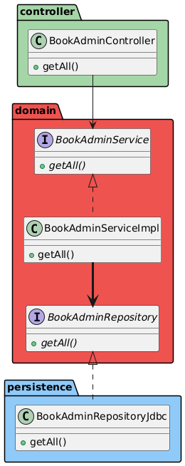
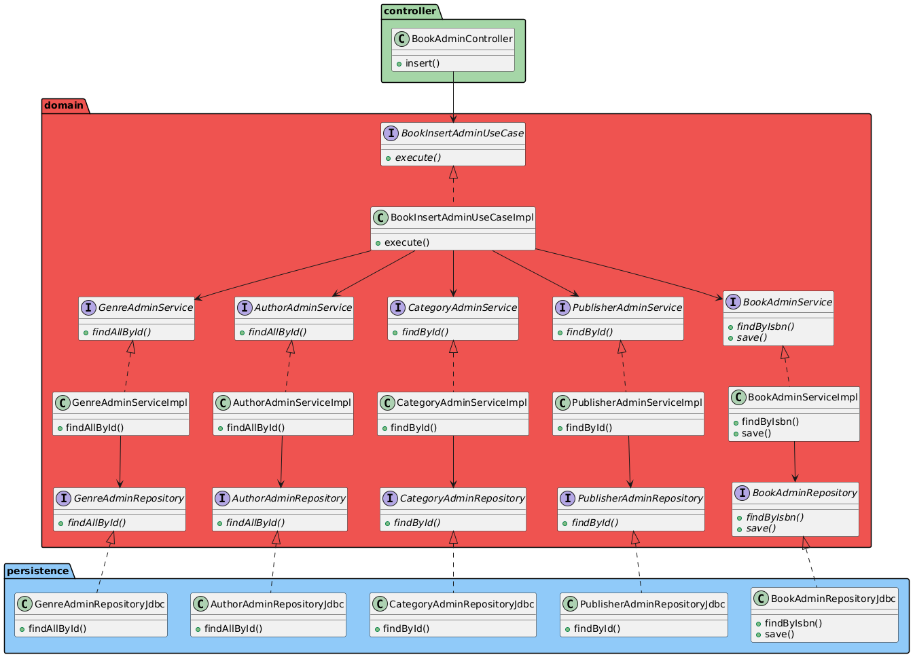

UNIT 05 - DOMAIN LAYER

# Table of Contents
- [Table of Contents](#table-of-contents)
- [Injection of Dependencies in the Domain Layer](#injection-of-dependencies-in-the-domain-layer)
- [Inversion of Control](#inversion-of-control)
- [Insertion of Data](#insertion-of-data)
  - [Reception and Data Mapping](#reception-and-data-mapping)
  - [Service and Model](#service-and-model)
  - [Repository Layer](#repository-layer)
  - [Use Cases](#use-cases)
    - [Data Mapping](#data-mapping)
  - [Transactions](#transactions)
- [Repository](#repository)

# Injection of Dependencies in the Domain Layer
[Up](#table-of-contents)

To maintain the independence of the framework in the domain layer, it is crucial to avoid relying directly on tools or libraries such as Spring, even when it makes dependency injection much easier with annotations such as `@Service`. 

If we wish to respect the principles of a clean architecture, we must ensure that the domain layer is not coupled to any external technology. 

The idea is to maintain the independence of the domain, but without losing the convenience that a framework like Spring offers to manage dependencies. Some options range from doing the dependency injection manually to creating our own container, or even using an abstraction that allows us to change the framework in the future without modifying the domain code. 

A practical and direct solution is to use an alias or an abstraction over the framework. In this way, we avoid having our domain classes depend directly on Spring annotations, but we still take advantage of the framework's functionality. This is the option we are going to develop, as it offers flexibility without adding unnecessary complexity. 

Instead of using Spring's `@Service` directly, we will create our own `@DomainService` annotation in the *common/annotation* package, which will simply be an alias. 

This means that our domain classes will not be coupled to Spring directly. If we switch frameworks in the future, we will only have to modify the implementation of this annotation without touching the rest of the code. 

```java
@Target(ElementType.TYPE)
@Retention(RetentionPolicy.RUNTIME)
@Service
public @interface DomainService {
}
```

In this case, we use two annotations:
- `@Target(ElementType.TYPE)`: This annotation is used to specify the type of element to which the annotation can be applied. In this case, it is a class.
- `Retention(RetentionPolicy.RUNTIME)`: This annotation is used to specify how long the annotation should be retained. In this case, it is retained at runtime.

Once our own annotation is creado, we can change `@Service` to `@DomainService` in the domain classes. 

```java
@DomainService
@RequiredArgsConstructor
public class BookServiceImpl implements BookService {
  // Rest of the class
}
```

# Inversion of Control
[Up](#table-of-contents)

In our system, the repositories are currently located in the persistence layer. However, this configuration poses a problem related to dependencies: there is a direct dependency from the domain layer to the persistence layer.

In a well-structured architecture, the flow of dependencies should be reversed, i.e. the persistence layer should depend on the domain layer.



# Insertion of Data
[Up](#table-of-contents)

We are going to implement a couple of method to insert a list of authors and genres to a book.

## Reception and Data Mapping
[Up](#table-of-contents)

We are going to start with the Controller, which will be responsible of reveiving the HTTP petitions with the information of the book and the authors and genres to be inserted.

```java
public class BookAdminController {
 
    ...
     
    @PostMapping("/{id}/authors")
    public ResponseEntity<Void> insertAuthors(@PathVariable Integer id, @RequestBody List<Author> authors) {
        bookAdminService.insertAuthors(id, authors);
        return new ResponseEntity<>(HttpStatus.CREATED);
    }
 
    @PostMapping("/{id}/genres")
    public ResponseEntity<Void> insertGenres(@PathVariable Integer id, @RequestBody List<Genre> genres) {
        bookAdminService.insertGenres(id, genres);
        return new ResponseEntity<>(HttpStatus.CREATED);
    }
 
    ...
}
```

> **Note**: In this case, the body of our response is empty. If everything has worked properly, we will return code 201 (HttpStatus.CREATED), indicating that the resource has been created. We could return the book with the new authors included, so that the client has the complete object. 

Both methods receive the ID of the book to which the authors or genres will be added, as well as the list of authors or genres to be inserted.

For example, when adding authors, the format of the body of the petition will be a JSON with an array of authors:

```json
[
    {
        "id": 3
    },
    {
        "id": 5
    }
]
```

The `@RequestBody` annotation is used to indicate that the authors parameter should be automatically filled with data from the HTTP request body. When a client sends a JSON in the request body, Spring converts that JSON into a `List<Author>` object thanks to automatic conversion (deserialization). This allows the controller to directly receive an object of type `List<Author>`, thus facilitating the manipulation of the data that has been received. 

## Service and Model
[Up](#table-of-contents)

The next step is to create the methods in the service. Both methods will be very similar.

```java
@Override
public void insertAuthors(int idBook, List<Author> authors) {
    //recuperar libro
    Book book = bookAdminRepository.findById(idBook).orElseThrow(() -> new ResourceNotFoundException("Book " + idBook + " not found"));
    //recuperar autores a insertar
    List<Author> authorList = authorAdminRepository.findAllById(
            authors
                    .stream()
                    .map(Author::getId)
                    .toArray(Long[]::new)
    );
    //comprobar que todos los autores pasados existen
    if(authorList.size() != authors.size()) {
        throw new ResourceNotFoundException("Some authors were not found");
    }
    //añadir autores al libro
    authorList.forEach(book::addAuthor);
    //guardar book
    bookAdminRepository.save(book);
}
```

The method `findAllById()` of the repository will receive an array of Long with the searched ID and will return the list of authors. Next, it will check if the number of elements is que same.

> **Note**: At this point, we could refine further and check which of the authors have not been found, in order to return more information to the client. In our case, we have opted for a simpler solution by simply indicating that some authors have not been found, but not giving information about who they are. 

The method of the Book model that adds an author to the book will be quite similar. First, we will check that the author exists and, if not, we will create an empty `ArrayList`. Them, we will cehck that the resource we want to add does not already exist in the list.  If exists, we will throw an exception. If everything if fine, we will add the author:

```java
public void addAuthor(Author author) {
    if (authors == null) {
        authors = new ArrayList<>();
    }
    if (authors.contains(author)) {
       throw new ResourceAlreadyExistsException("Author " + author.getName() + "already exists");
    }
    authors.add(author);
}
```

> **Note**: Remember to add the treatment of the new exception:
> ```java
> @ResponseStatus(HttpStatus.BAD_REQUEST)
> @ExceptionHandler({
>         ResourceAlreadyExistsException.class
> })
> @ResponseBody
> public ErrorMessage resourceAlreadyExists(ResourceAlreadyExistsException > exception) {
>     log.error(exception.getMessage());
>     return new ErrorMessage(exception);
> }
> ```

## Repository Layer
[Up](#table-of-contents)

In the book repository, the first thing to do is to create the `findById` method. In this case, we have chosen to work with `id` instead of `isbn` to make SQL statements easier later on:

```java
@Override
public Optional<Book> findById(int id) {
    String sql = """
            SELECT * FROM books
            LEFT JOIN categories ON books.category_id = categories.id
            LEFT JOIN publishers ON books.publisher_id = publishers.id
            WHERE books.id = ?
       """;
    try {
        Book book = jdbcTemplate.queryForObject(sql, new BookRowMapper(), id);
        book.setAuthors(authorAdminRepository.getByIdBook(id));
        book.setGenres(genreAdminRepository.getByIdBook(id));
        return Optional.of(book);
    } catch (Exception e) {
        return Optional.empty();
    }
}
```

The next method we want to implement is `findAllById` in the *Author*'s repository. This method will receive an array of IDs and return a list of authors. 

```java
@Override
public List<Author> findAllById(Long[] ids) {
    String sql = """
           SELECT authors.* FROM authors
           WHERE id IN (:ids)   
       """;
    Map<String, List<Long>> params = Map.of("ids", Arrays.asList(ids));
    return namedParameterJdbcTemplate.query(sql, params, new AuthorRowMapper());
}
```

In this case we use the class `NamedParameterJdcbTemplate`, that allows us to pass the parameters with `:parameter_name` instead of `?`. This makes the code more readable and easier to maintain.

> **Note**: Remember to define the attribut at the beginning of the class so that Spring can inject the `NamedParameterJdbcTemplate` object:
>
> ```java
> @Repository
> @RequiredArgsConstructor
> public class AuthorAdminRepositoryImpl implements AuthorAdminRepository {
>  
>     private final JdbcTemplate jdbcTemplate;
>     private final NamedParameterJdbcTemplate namedParameterJdbcTemplate;
> // Rest of the class
> }
> ```

Finally, we have to create the save method. This method will take care of inserting or updating a book (including publisher, category, genres and authors): 

```java
@Override
public void save(Book book) {
    //Si el id existe, actualizar, si no, instalar
    if(book.getId() != null) {
        update(book);
    } else {
        long id = insert(book);
        book.setId(id);
    }
    this.deleteAuthors(book.getId());
    this.insertAuthors(book.getId(), book.getAuthors());
    this.deleteGenres(book.getId());
    this.insertGenres(book.getId(), book.getGenres());
}
```

All that remains is to construct the methods for inserting, updating, deleting and inserting authors and genres: 

```java
private void update(Book book) {
    String sql = """
                UPDATE books
                SET isbn = ?,
                    title_es = ?,
                    title_en = ?,
                    synopsis_es = ?,
                    synopsis_en = ?,
                    price = ?,
                    discount = ?,
                    cover = ?,
                    publisher_id = ?,
                    category_id = ?
                WHERE id = ?
            """;
    jdbcTemplate.update(
            sql,
            book.getIsbn(),
            book.getTitleEs(),
            book.getTitleEn(),
            book.getSynopsisEs(),
            book.getSynopsisEn(),
            book.getPrice(),
            book.getDiscount(),
            book.getCover(),
            book.getPublisher().getId(),
            book.getCategory().getId(),
            book.getId()
    );
}
 
private long insert(Book book) {
    String sql = """
                INSERT INTO books(
                  isbn, 
                  title_es, 
                  title_en, 
                  synopsis_es, 
                  synopsis_en, 
                  price, 
                  discount, 
                  cover, 
                  publisher_id, 
                  category_id)
                VALUES(?, ?, ?, ?, ?, ?, ?, ?, ?, ?)
            """;
    KeyHolder keyHolder = new GeneratedKeyHolder();
 
    jdbcTemplate.update(connection -> {
        PreparedStatement ps = connection.prepareStatement(sql, new String[] {"id"});
        ps.setString(1, book.getIsbn());
        ps.setString(2, book.getTitleEs());
        ps.setString(3, book.getTitleEn());
        ps.setString(4, book.getSynopsisEs());
        ps.setString(5, book.getSynopsisEn());
        ps.setBigDecimal(6, book.getPrice());
        ps.setFloat(7, book.getDiscount());
        ps.setString(8, book.getCover());
        ps.setLong(9, book.getPublisher().getId());
        ps.setLong(10, book.getCategory().getId());
        return ps;
    }, keyHolder);
 
    return keyHolder.getKey().longValue(); // Devuelve el id generado
}
 
private void deleteAuthors(long id) {
    String sql = """
                DELETE FROM books_authors
                WHERE book_id = ?
            """;
    jdbcTemplate.update(sql, id);
}
 
private void insertAuthors(long id, List<Author> authors) {
    String sql = """
                INSERT INTO books_authors(book_id, author_id)
                VALUES (?, ?)
            """;
    authors.stream().forEach(a -> jdbcTemplate.update(sql, id, a.getId()));
}
 
private void deleteGenres(long id) {
    String sql = """
                DELETE FROM books_genres
                WHERE book_id = ?
            """;
    jdbcTemplate.update(sql, id);
}
 
private void insertGenres(long id, List<Genre> genres) {
    String sql = """
                INSERT INTO books_genres(book_id, genre_id)
                VALUES(?, ?)
            """;
    genres.stream().forEach(g -> jdbcTemplate.update(sql, id, g.getId()));
}
```

## Use Cases
[Up](#table-of-contents)

Let's implement the insertion of a Book. We create the method in the controller:

```java
@PostMapping
public ResponseEntity<Void> insert(@RequestBody Book book) {
    bookAdminService.insert(book);
    return new ResponseEntity<>(HttpStatus.CREATED);
}
```

he JSON we reveice is something like this:

```json
{
    "isbn": "12345",
    "titleEs": "Nuevo libro",
    "titleEn": "New book",
    "synopsisEs": "Sinopsis nuevo libro",
    "synopsisEn": "Synopsis new book",
    "price": 12.30,
    "discount": 0.5,
    "cover": "nuevo_libro.jpg",
    "publisher": {
        "id": 2
    },
    "category": {
        "id": 4
    },
    "genres": [
        {
            "id": 5
        },
        {
            "id": 6
        }
    ],
    "authors": [
        {
            "id": 8
        }
    ]
}
```

In our service the method `insert` would have to make some actions:

```java
@Override
public void insert(Book book) {
    if(bookAdminRepository.findByIsbn(book.getIsbn()).isPresent()) {
        throw new ResourceAlreadyExistsException("Isbn " + book.getIsbn() + " already exists");
    }
    //comprobar el publisher
    if(publisherAdminRepository.findById(book.getPublisher().getId()).isEmpty()) {
        throw new ResourceNotFoundException("Publisher " + book.getPublisher().getId() + " not found");
    }
    //comprobar la categoría
    if(categoryAdminRepository.findById(book.getCategory().getId()).isEmpty()) {
        throw new ResourceNotFoundException("Category " + book.getCategory().getId() + " not found");
    }
    //recuperar autores a insertar
    List<Author> authorList = authorAdminRepository.findAllById(
            book.getAuthors()
                    .stream()
                    .map(Author::getId)
                    .toArray(Long[]::new)
    );
    //comprobar que todos los autores pasados existen
    if(authorList.size() != book.getAuthors().size()) {
        throw new ResourceNotFoundException("Some authors were not found");
    }
    //añadir autores al libro
    book.setAuthors(new ArrayList<>());
    authorList.forEach(book::addAuthor);
    //recuperar géneros a insertar
    List<Genre> genreList = genreAdminRepository.findAllById(
            book.getGenres()
                    .stream()
                    .map(Genre::getId)
                    .toArray(Long[]::new)
    );
    //comprobar que todos los géneros pasados existen
    if(genreList.size() != book.getGenres().size()) {
        throw new ResourceNotFoundException("Some genres were not found");
    }
    //añadir géneros al libro
    book.setGenres(new ArrayList<>());
    genreList.forEach(book::addGenre);
 
    bookAdminRepository.save(book);
 
}
```

The is a lot of code shared with `insertAuthors` and `intertGenres`. We could refactor this methods to group this common code. Altough in our case we are going to create use cases.

The idea is that the services do basic operations and the use cases will be responsible for calling the different services.

We will create the different use cases with an unic public method `execute()`, that will call the controller.



In this way, the actions that the services do are shared with all the use cases that call it. For example, our `BookInsertAdminUseCaseImpl` will be:

```java
@DomainUseCase
@RequiredArgsConstructor
public class BookInsertAdminUseCaseImpl implements BookInsertAdminUseCase {
 
    private final BookAdminService bookAdminService;
    private final AuthorAdminService authorAdminService;
    private final GenreAdminService genreAdminService;
    private final PublisherAdminService publisherAdminService;
    private final CategoryAdminService categoryAdminService;
 
    @Override
    public void execute(Book book) {
        if(bookAdminService.findByIsbn(book.getIsbn()).isPresent()) {
            throw new ResourceAlreadyExistsException("Book with ISBN " + book.getIsbn() + " already exists");
        }
        book.setPublisher(publisherAdminService
                .findById(book.getPublisher().getId())
                .orElseThrow(() -> new ResourceNotFoundException("Publisher " + book.getPublisher().getName() + " not found")));
        book.setCategory(categoryAdminService
                .findById(book.getCategory().getId())
                .orElseThrow(() -> new ResourceNotFoundException("Category " + book.getCategory().getId() + " not found")));
        book.setAuthors(authorAdminService
                .findAllById(book.getAuthors()));
        book.setGenres(genreAdminService
                .findAllById(book.getGenres()));
        bookAdminService.save(book);
    }
}
```

> **Note**: Note that we have used another custom tag: `@DomainUseCase`, which we must create in the same way as `@DomainService` (we can use `@Component` in the tag definition instead of `@Service`). 

The *Author* service would be like this:

```java
@DomainService
@RequiredArgsConstructor
public class AuthorAdminServiceImpl implements AuthorAdminService {
 
    private final AuthorAdminRepository authorAdminRepository;
 
    @Override
    public List<Author> getByIdBook(long idBook) {
        return authorAdminRepository.getByIdBook(idBook);
    }
 
    @Override
    public List<Author> findAllById(List<Author> authors) {
        List<Author> foundAuthors =  authorAdminRepository.findAllById(
                authors
                        .stream()
                        .map(Author::getId)
                        .toArray(Long[]::new)
        );
        if(foundAuthors.size() != authors.size()) {
            throw new ResourceNotFoundException("Some authors were not found");
        }
        return foundAuthors;
    }
}
```

In this way, the use case to insert authors to a book will call the same method of the service, further separating the responsibilities of each layer: 

```java
@DomainUseCase
@RequiredArgsConstructor
public class BookInsertAuthorsAdminUseCaseImpl implements BookInsertAuthorsAdminUseCase {
 
 
    private final BookAdminService bookAdminService;
    private final AuthorAdminService authorAdminService;
 
    @Override
    public void execute(int id, List<Author> authors) {
        Book book = bookAdminService.findById(id).orElseThrow(() -> new ResourceNotFoundException("Book " + id + " not found"));
        authorAdminService
                .findAllById(authors)
                .forEach(author -> bookAdminService.addAuthor(book, author));
        bookAdminService.save(book);
    }
}
```

Another advantage is that we can take the data validations to the services. Although we will go into more detail when we look at validations, the idea is that it is the service that validates the data, instead of the model, so that if we add new validations when our application is already in production, when reading the data it will not be necessary to make those checks, since there could be previous data in the database that do not meet that condition: 

```java
@DomainService
@RequiredArgsConstructor
public class BookAdminServiceImpl implements BookAdminService {
 
    private final BookAdminRepository bookAdminRepository;
 
    @Override
    public List<Book> getAll() {
        return bookAdminRepository.getAll();
    }
 
    @Override
    public List<Book> getAll(int page, int size) {
        return bookAdminRepository.getAll(page, size);
    }
 
    @Override
    public int count() {
        return bookAdminRepository.count();
    }
 
    @Override
    public Optional<Book> findByIsbn(String isbn) {
        return bookAdminRepository.findByIsbn(isbn);
    }
 
    @Override
    public Optional<Book> findById(long id) {
        return bookAdminRepository.findById(id);
    }
 
    @Override
    public void save(Book book) {
        bookAdminRepository.save(book);
    }
 
    @Override
    public void addAuthor(Book book, Author author) {
        if (book.getAuthors() == null) {
            book.setAuthors(new ArrayList<>());
        }
        if (book.getAuthors().contains(author)) {
            throw new ResourceAlreadyExistsException("Author " + author.getName() + "already exists");
        }
        book.addAuthor(author);
    }
 
    @Override
    public void addGenre(Book book, Genre genre) {
        if (book.getGenres() == null) {
            book.setGenres(new ArrayList<>());
        }
        if (book.getGenres().contains(genre)) {
            throw new ResourceAlreadyExistsException("Genre " + genre.getId() + "already exists");
        }
        book.addGenre(genre);
    }
 
}
```

### Data Mapping
[Up](#table-of-contents)

Until this moment, we are dividing controllers, use cases, services and repositories into admin and user. In this case, each role has its own data model, and the mapping is done in the repository. 

This approach has the advantage of having everything separated, so we can perform different actions depending on the user's role. For example, we could make the getAll() method of the administrator's book service different from that of the user.

The problem is that our code increases (with the associated complexity). Also, if most services are going to be the same, it is not worth this strategy (think that we have a Count() method for admin and another for user that do exactly the same thing). 

Podríamos simplificar el proceso haciendo que los servicios y repositorios fueran comunes, y sean los casos de uso los que transformen los datos al modelo correspondiente (admin o user), con lo que reduciríamos significativamente el número de clases. 

We could even have a common data model and create the necessary models according to the roles. That is, in our domain layer we would have, for example, the `Book` model:

```java
@Data
@AllArgsConstructor
@NoArgsConstructor
public class Book {
 
    private Long id;
    private String isbn;
    private String titleEs;
    private String titleEn;
    private String synopsisEs;
    private String synopsisEn;
    private BigDecimal price;
    private float discount;
    private String cover;
    private Publisher publisher;
    private Category category;
    private List<Genre> genres;
    private List<Author> authors;
 
    public String getTitle() {
        String language = LanguageUtils.getCurrentLanguage();
        if ("en".equals(language)) {
            return titleEn;
        }
        return titleEs;
    }
 
    public String getSynopsis() {
        String language = LanguageUtils.getCurrentLanguage();
        if ("en".equals(language)) {
            return synopsisEn;
        }
        return synopsisEs;
    }
 
    public void addAuthor(Author author) {
        authors.add(author);
    }
 
    public void addGenre(Genre genre) {
        genres.add(genre);
    }
}
```

And we would create other exclusive data method for the user use cases:

```java
public BookUser(String isbn, String title, String synopsis, BigDecimal price, float discount, String cover, PublisherUser publisher, CategoryUser category, List<AuthorUser> authors, List<GenreUser> genres) {
        this.isbn = isbn;
        this.title = title;
        this.synopsis = synopsis;
        setPrice(price);
        this.discount = discount;
        this.cover = cover;
        this.publisher = publisher;
        this.category = category;
        this.authors = authors;
        this.genres = genres;
    }
 
    public void setPrice(BigDecimal price) {
        if (price == null) {
            price = new BigDecimal(0);
        }
        this.price = price.setScale(2, RoundingMode.HALF_UP);
    }
 
}
```

Obviously, this would force us to create mappers in the user use cases, to transform what is returned by the service (general *Book* model) to the user (*BookUser* model): 

```java
@Mapper(uses = {PublisherMapper.class, GenreMapper.class, AuthorMapper.class, CategoryMapper.class})
public interface BookMapper {
 
    BookMapper INSTANCE = Mappers.getMapper(BookMapper.class);
 
    BookUser toBookUser(Book book);
 
}
```

In this way, we could have the use cases separated into admin, user and common ones, which would call the corresponding services (which would be the same for all the use cases). For example, we would have the common use case BookCountUseCase: 

```java
@DomainUseCase
@DomainTransactional
@RequiredArgsConstructor
public class BookCountUseCaseImpl implements BookCountUseCase {
 
    private final BookService bookService;
 
    @Override
    public int execute() {
        return bookService.count();
    }
}
```

The use case for the `findByIsbn` of the admin would be:

```java
@DomainUseCase
@RequiredArgsConstructor
public class BookFindByIsbnAdminUseCaseImpl implements BookFindByIsbnAdminUseCase {
 
    private final BookService bookService;
 
    @Override
    public Book execute(String isbn) {
        return bookService
                .findByIsbn(isbn)
                .orElseThrow(() -> new ResourceNotFoundException("Book isbn " + isbn + " not found"));
    }
}
```

Meanwhile, the use case for the user would be:

```java
@DomainUseCase
@RequiredArgsConstructor
public class BookFindByIsbnUserUseCaseImpl implements BookFindByIsbnUserUseCase {
 
    private final BookService bookService;
 
    @Override
    public BookUser execute(String isbn) {
        return BookMapper.INSTANCE.toBookUser(
                bookService
                        .findByIsbn(isbn)
                        .orElseThrow(() -> new ResourceNotFoundException("Book isbn " + isbn + " not found"))
        );
// Rest of the code
```

## Transactions
[Up](#table-of-contents)

Let's come back to the `save()` method of the *Book* repository:

```java
@Override
public void save(Book book) {
    //Si el id existe, actualizar, si no, instalar
    if(book.getId() != null) {
        update(book);
    } else {
        long id = insert(book);
        book.setId(id);
    }
    this.deleteAuthors(book.getId());
    this.insertAuthors(book.getId(), book.getAuthors());
    this.deleteGenres(book.getId());
    this.insertGenres(book.getId(), book.getGenres());
}
```

In this case, we are inserting data in different tables. What happens if the insertion fails in the books_authos table? The database would be left with incorrect data, since we would have inserted a book (query that has not failed) without authors or genres. To make sure that the operations are all done (or none, if there is any failure), we can resort to transactions.

Fortunately, Spring offers us a way to manage transactions in a simple way. We can use the `@Transactional` annotation in the service method that we want to be transactional. We are going to create out annotation, that will be an alias of the Spring annotation, like before:

```java
@Target(ElementType.TYPE)
@Retention(RetentionPolicy.RUNTIME)
@Transactional
public @interface DomainTransactional {
}
```

The best option, in this case, would be to use the new label in the use cases: 

```java
@DomainUseCase
@DomainTransactional
@RequiredArgsConstructor
public class BookInsertUseCaseImpl implements BookInsertUseCase {
  // Rest of the code
```

In this way, we ensure that all actions in the use case are performed or, if any fail, none are performed. 

# Repository
[Up](#table-of-contents)

https://github.com/cesguiro/dws-spring/tree/develop/dws-domain

https://github.com/cesguiro/dws-spring/tree/develop/dws-domain2
