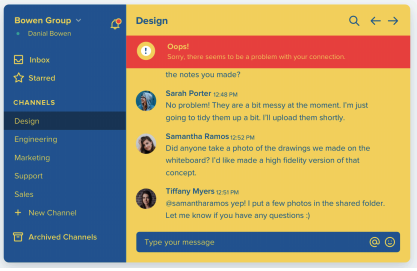
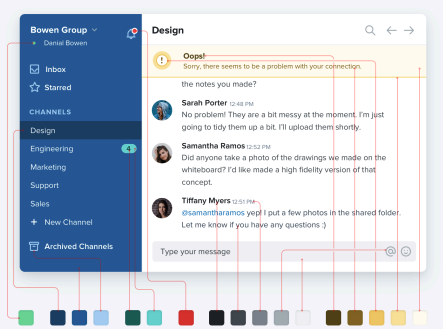
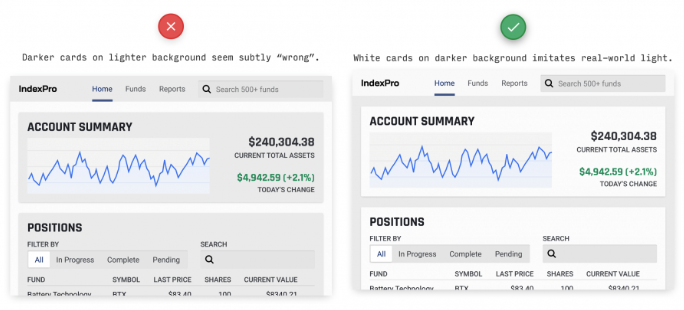
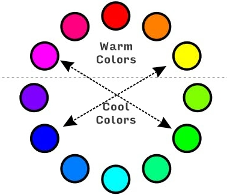
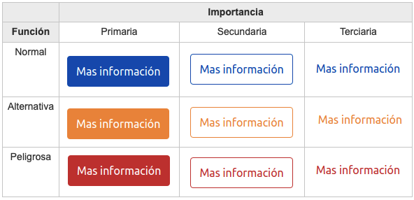

# Design Standars

- Make things that are not related be far apart from each other. That is to say that there is a lot of white space. And then we will see if you put them together a little bit.
- The design does not have to occupy 100% of the screen because in very big screens it looks bad.
- Make things are aligned to an imaginary straight line that goes from top to bottom.
- Highlight what is important.
- Repel attention from what is not important (smaller, more spacious, lower contrast).
- Avoid using labels or captions. If you see “ventas@persianas.com” you already know it is an email, there is no need to indicate that it is the email. But if you use a label that is part of a sentence. “3 in stock” instead of ‘Stock:3’. And even then, if you use them, make them de-emphasized.
- Titles `<h1>` don't have to stand out because sometimes they are not important since the title is obvious. `<h1>` is so that the search engine knows that it is important.
- Square corners indicate seriousness. Very rounded corners are very informal (border-radious).
- For emphasis instead of larger font size, use bold. But to de-emphasize, use a gray font color instead of black text.
- Never use a carousel.
- Don't write everything in upper-case. It's difficult to read. Use `<em>`, styles or similar.

# Colors

- We need a big color palette.
- Main color.
- Alternative color.
- Gray scale.
- White scale.
- Red scale.
- Green scale.
- Blue scale.
- Yellow scale.

Whites and grays are used to make things clear or dark.

The main color gamma is used for almost everything. 

The alternative color gamma is used for buttons, links, and other things that need to stand out.

Not like this:


Like this:


## Doing a Basic Color Palette

- We choose the color (for main color, alternate color, red, blue, green...).
- This one is in the middle of the palette (color 5 or 50%).
- We put 4 colors at the left and 4 colors at the right.
- Luminosity:
  - We change + or - 10% the luminosity
  - Main color: 50% luminosity.
  - Darker colors: 60, 70, 80, 90& luminosity.
  - Ligher colors: 10, 20, 30, 40% luminosity.
- Saturation:
  - U-shape.
  - Without arriving to 0 nor 100.
  - 10%: 90.
  - 20%: 80.
  - 30%: 70.
  - 40%: 60.
  - 50%: 50.
  - 60%: 60.
  - 70%: 70.
  - 80%: 80.
  - 90%: 90.
- The colos has to change slightly.
  - Right: +3 each one.
    - 50%: 297.
    - 60%: 300.
    - 70%: 303.
    - 80%: 306.
    - 90%: 309.
  - Left: -3 each one.
  - To be more specific, by hand (for pros).

# Light

Things that are above must be lighter than things that are below.



# Color Contrast

When doing a user interface, we should use two colors that contrast with each other. 

The contrast is the difference between the two colors. The contrast is measured in a scale from 1 to 21. The contrast is calculated by the formula:
    
```css
contrast = (L1 + 0.05) / (L2 + 0.05)
```

Where L1 is the lighter color and L2 is the darker color.

The contrast should be at least 4.5.

One simple option is using a warm color and a cold color. For easy use, the one that is at the opposite:

   

# Buttons

2 characteristics of a button:
- Importance: if we want that the client clicks on it, we should make it stand out.
- Function: if we want that the client knows what the button does, we should make it look like a button.


# Size System

*Notes here*

# User Experience

*Notes here*

# AI and Design

*Notes here*