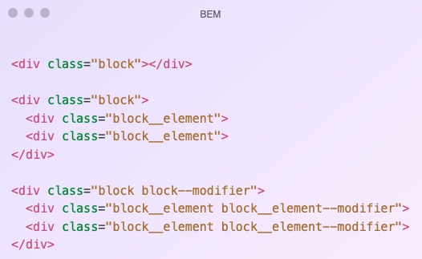

# Table of Contents
- [Table of Contents](#table-of-contents)
- [Layout CSS](#layout-css)
- [Reset CSS](#reset-css)
- [CSS Arquitecture](#css-arquitecture)
- [Files' Structure](#files-structure)

# Layout CSS
[Up](#table-of-contents)

*Notes here*

# Reset CSS
[Up](#table-of-contents)

*Notes here*

# CSS Arquitecture
[Up](#table-of-contents)

We are going to use BEM (Block Element Modifier) for the CSS architecture. This is a methodology that helps you to create reusable components and code sharing in front-end development.

Objetives:
- Predictable.
- Reusable.
- Maintainable.
- Scalable.



# Files' Structure
[Up](#table-of-contents)

```
/scss
   /01_utilities
       _css-variables.scss
       _sass-variables.scss
       _functions.scss
       _mixins.scss
  /02_base
      _override.scss
      _reset.scss
      _typography.scss
  /03_layout
      _cada_uno_de_los_layouts.scss
  /04_components
      _cada_uno_de_los_componentes.scss
  /05_pages
      _estilos_especificos_de_una_pagina_concreta.scss
  /06_global
      _cada_una_de_los_modificadores_globales.scss
  main.scss
```

```
/01_utilities
_css-variables.scss: css variables such as colors or margin sizes, etc.
_sass-variables.scss: SASS variables like e.g. colors or margin sizes, etc.
_functions.scss: SASS functions
_mixins.scss: SASS Mixins

/02_base
_override.scss: It is to override CSS of some library that is used.
_reset.scss: The reset that we use
_typography.scss: Things related to typography

/03_layout
_each_of_the_layouts.scss: There will be a file for each Block that is of layout type. For example _l-page.scss

/04_components
each_one_of_the_components.scss: There will be a file for each Block that is of type Component. For example _c-button.scss , _c-panel.scss or _c-body

/05_pages
specific_styles_of_a_concrete_page.scss: If there is css that is specific to a specific page. There should never be anything here.

/06_global
_each_of_the_global_modifiers.scss: There will be a file for each type of modifier there is. For example _g--margin.scss
main.scss: All the SASS code is grouped here and it is the only file that is transformed into CSS.
```