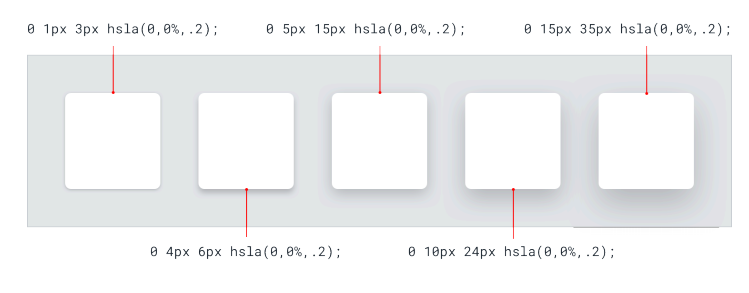

# Table of Contents

- [Table of Contents](#table-of-contents)
- [How to add CSS to a webpage](#how-to-add-css-to-a-webpage)
- [Selectors and Specificity](#selectors-and-specificity)
- [Box Model](#box-model)
- [Display](#display)
- [Display: none vs Visibility: hidden](#display-none-vs-visibility-hidden)
- [Tag `&nbsp;`](#tag-nbsp)
- [Shadows](#shadows)
- [Meter and Progress](#meter-and-progress)

# How to add CSS to a webpage
[Up](#table-of-contents)

- External CSS
```html
<!--Inside the Header-->
<link rel="stylesheet" href="main.css">
```
- Adding the `<style>` tag:
```html
<style>
body {
  background-color: #FF00FF;
}
 
h1 {
  color: #FE56A2;
  margin-left: 40px;
}
</style>
```
- Inline CSS
```html
<h1 style="color:blue;text-align:center;">This is a heading</h1>
```

We should only use external CSS files and, sometimes, the `<style>` tag like a background.

# Selectors and Specificity
[Up](#table-of-contents)

Practically allways the class selector.

# Box Model
[Up](#table-of-contents)

It is used to understand the design and layout of the elements in a webpage.

- Content: The content of the box, where text and images appear.
- Padding: Clears an area around the content. The padding is transparent.
- Border: A border that goes around the padding and content.
- Margin: Clears an area outside the border. The margin is transparent.

`Box-sizing`: The `box-sizing` property allows us to include the padding and border in an element's total width and height.

```css 
html {
  box-sizing: border-box;
}
 
*, *:before, *:after {
  box-sizing: inherit;
  }
```

We have to add the previous code to the `reset.css`.

# Display
[Up](#table-of-contents)

- `display: block;`: The element will take up the full width available.
- `display: inline;`: The element will take up the space it needs.
- `display: inline-block;`: The element will take up the space it needs and allow other elements to sit next to it. We can set the width and height of the element.

# Display: none vs Visibility: hidden
[Up](#table-of-contents)

- `display: none;`: The element will be hidden, and the page will be displayed as if the element is not there.
- `visibility: hidden;`: The element will be hidden, but the space it takes up will still be visible.

# Tag `&nbsp;`
[Up](#table-of-contents)

Makes a space with `&nbsp;` as one more letter so it will not break the sentence by that space.

```html
<p>First paragraph&nbsp
Second paragraph</p>
```

# Shadows
[Up](#table-of-contents)

Shadows are used to give a sense of depth without the need for edges. 

We assume that the light comes from above.

```css
div {
  box-shadow: 10px 10px 5px 12px lightblue;
}
```
- The first value is the horizontal shadow.
- The second value is the vertical shadow.
- The third value is the blur radius.
- The fourth value is the spread radius.
- The fifth value is the color.
- `inset` changes the shadow from an outer shadow (outset) to an inner shadow.

We can add multiple shadows:
```css
div {
  box-shadow:   5px 5px blue, 
                10px 10px red, 
                15px 15px green;
}
```



# Meter and Progress
[Up](#table-of-contents)

- `progress`: Progress bar. Used to convey how much work in a task has been completed
- `meter`: Meter bar. Used to display a measurement on a known scale.

```html
<progress value="50" max="100"></progress>
<meter min="0" max="100" low="25" high="75" optimum="50" value="50"></meter>
```