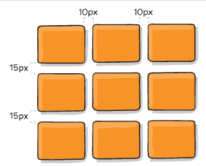

# Table of Contents
- [Table of Contents](#table-of-contents)
- [Flexbox](#flexbox)
  - [`flex-direction`](#flex-direction)
  - [`flex-wrap`](#flex-wrap)
  - [`justify-content`](#justify-content)
  - [`align-content`](#align-content)
  - [`align-items`](#align-items)
  - [`flex-grow`](#flex-grow)
  - [`flex`](#flex)
  - [`margin` and `auto`](#margin-and-auto)
- [Grid](#grid)
  - [`grid-template-columns`](#grid-template-columns)
  - [`repeat`](#repeat)
  - [`auto-fit`](#auto-fit)
  - [`grid-template-rows`](#grid-template-rows)
  - [`gap`](#gap)
  - [Layout Block by Columns](#layout-block-by-columns)
  - [`span`](#span)
- [BEM Rules of Layout](#bem-rules-of-layout)

# Flexbox
[Up](#table-of-contents)

Flex is used to put things horizontally or vertically.

Resources:
- [A Complete Guide to Flexbox](https://css-tricks.com/snippets/css/a-guide-to-flexbox/)
- [Flexbox Layout Cheatsheet. Otra guía rápida de flexbox](https://logongas.es/lib/exe/fetch.php?media=clase:daw:diw:1eval:css_flexbox_layout_cheatsheet.pdf)
- [The Complete CSS Flex Box Tutorial](https://medium.com/@js_tut/the-complete-css-flex-box-tutorial-d17971950bdc)
- [Flexbox - The Animated Tutorial](https://medium.com/@js_tut/flexbox-the-animated-tutorial-8075cbe4c1b2)
- [In CSS Flexbox, why are there no "justify-items" and "justify-self" properties?](https://stackoverflow.com/questions/32551291/in-css-flexbox-why-are-there-no-justify-items-and-justify-self-properties)
- [Flexbox Froggy - A game for learning CSS flexbox](https://flexboxfroggy.com/#es)

We are going to explain flex with the following example:

```html
<div class="l-flex l-flex--direction-row l-flex--justify-content-center">
  <div clas="l-flex__area">Item1</div>
  <div clas="l-flex__area">Item2</div> 
  <div clas="l-flex__area l-flex__area--grow-2 ">Item3</div>
  <div clas="l-flex__area">Item4</div> 
  <div clas="l-flex__area">Item5</div> 
</div>
```
```css
.l-flex {
  display:flex;
}
 
 
.l-flex--direction-row {
  flex-direction:row
}
 
.l-flex--justify-content-center {
  justify-content:center
}
 
.l-flex__area--grow-2 {
  flex-grow:2
}
```

There are two types of elements: the container and the items inside of it.

The container always has `display: flex`.

Another example:

```html
<div class="l-flex l-flex--direction-row l-flex--justify-content-center">
  <div clas="l-flex__area">
   
        <div class="l-flex l-flex--direction-row l-flex--justify-content-center">
          <div clas="l-flex__area"></div>
          <div clas="l-flex__area"></div>         
        </div>
   
  </div>
  <div clas="l-flex__area">Item2</div> 
  <div clas="l-flex__area l-flex__area--grow-2 ">Item3</div>
  <div clas="l-flex__area">Item4</div> 
  <div clas="l-flex__area">Item5</div> 
</div>
```

## `flex-direction`
[Up](#table-of-contents)

- `flex-direction:row`: Items are located horizontally (in one line).


- `flex-direction:column`: Items are located vertically (in one line).

 

## `flex-wrap`
[Up](#table-of-contents)

- `flex-wrap:wrap`: If it does not fit in on the same line, passes to the next one.


## `justify-content`
[Up](#table-of-contents)


- `justify-content:flex-start`: Items are located at the beginning of the container.: Items are located at the beginning of the container.
- `justify-content:flex-end`: Items are located at the end of the container.
- `justify-content:center`: Items are located in the center of the container.
- `justify-content:space-between`: Items are located with the same space between them.
- `justify-content:space-around`: Items are located with the same space around them.
- `justify-content:space-evenly`: Items are located with the same space between them.


## `align-content`
[Up](#table-of-contents)

- `align-content:flex-start`: Items are located at the beginning of the container.
- `align-content:flex-end`: Items are located at the end of the container.
- `align-content:center`: Items are located in the center of the container.
- `align-content:stretch`: Items are located with the same space between them.
- `align-content:space-between`: Items are located with the same space between them.
- `align-content:space-around`: Items are located with the same space around them.


## `align-items`
[Up](#table-of-contents)

- `align-items:flex-start`: Items are located at the beginning of the container.
- `align-items:flex-end`: Items are located at the end of the container.
- `align-items:center`: Items are located in the center of the container.
- `align-items:stretch`: Items are located with the same space between them.
- `align-items:baseline`: Items are located with the same space between them.


## `flex-grow`
[Up](#table-of-contents)

- `flex-grow`: It is used to grow the item. The value is a number. The default value is 0.
  - `flex-grow:0`: The item does not grow.
  - `flex-grow:1`: The item grows.
  - `flex-grow:2`: The item grows twice.
- `flex-shrink`: It is used to shrink the item. The value is a number. The default value is 1.
- `flex-basis`: It is used to set the initial size of the item. The value is a number. The default value is auto.

It is used in the child elements.

## `flex`
[Up](#table-of-contents)

It is used to set the three properties at the same time (grow, shrink & basis). 

The value is a number. 

The default value is 0 1 auto.

It is used inside the child elements.

More information:
- [Understanding flex-grow, flex-shrink, and flex-basis](https://css-tricks.com/understanding-flex-grow-flex-shrink-and-flex-basis/).
- [Diferencia entre flex basis y width](https://www.paradigmadigital.com/dev/diferencia-flex-basis-width/).
- [Guía definitiva de Flexbox (2): Flex basis, flex-grow, flex-shrink](https://ed.team/blog/guia-definitiva-de-flexbox-2-flex-basis-flex-frow-flex-shrink).
- [Las propiedades flex grow, flex-shrink y flex-basis](https://www.desarrollolibre.net/blog/css/las-propiedades-flex-grow-flex-shrink-y-flex-basis).

## `margin` and `auto`
[Up](#table-of-contents)

```html
<div style="display:flex">
  <div >Item1</div>
  <div >Item2</div>
  <div >Item3</div>  
  <div style="margin-left:auto">Item4</div> 
  <div >Item5</div> 
</div>
```

In this example, items 1, 2 and 3 will be aligned to the left, item 4 will be aligned to the right and item 5 will be aligned to the left.

If we want to align item 1, 2 and 3 to the left, item 4 to the center and item 5 to the right, we can use the following code:

```html
<div style="display:flex">
  <div >Item1</div>
  <div >Item2</div>
  <div >Item3</div>  
  <div style="margin-left:auto;margin-right:auto">Item4</div> 
  <div>Item5</div>
</div>
```

More information:
- [The Most Popular Navigation Bars Created With Flexbox](https://medium.com/flexbox-and-grids/the-most-popular-navigation-bars-created-with-flexbox-6c0f59f55686).
- [Understanding Flexbox - auto-margin](https://github.com/ohansemmanuel/Understanding-Flexbox/blob/master/05.%20Auto%20margin%20alignment/auto_margin.md).

# Grid
[Up](#table-of-contents)

It allows putting the elements in 2 dimensions.

Resources:
- Complete Grid guides:
  - [Getting Started with CSS Grid](https://css-tricks.com/getting-started-css-grid/).
  - [A Complete Guide to Grid](https://css-tricks.com/snippets/css/complete-guide-grid).
  - [CSS Grid is a two-dimensional layout system created specifically to tackle grid-based user interfaces on the web](https://tympanus.net/codrops/css_reference/grid/).
  - [The Ultimate CSS Grid Tutorial for Beginners (With Interactive Examples)](https://www.codeinwp.com/blog/css-grid-tutorial-layout/).
  - [css_grid_layout_cheat_sheet](https://logongas.es/lib/exe/fetch.php?media=clase:daw:diw:1eval:css_grid_layout_cheatsheet.pdf).
- Grid vs Flex:
  - [Video: Flexbox vs CSS Grid - Which Is Better?](https://www.youtube.com/watch?v=hs3piaN4b5I).
  - [Does CSS Grid Replace Flexbox](https://css-tricks.com/css-grid-replace-flexbox/).
- More information:
  - [justify-items](https://css-tricks.com/almanac/properties/j/justify-items/).
  - [Los 9 grandes errores con CSS Grid](https://www.youtube.com/watch?v=0Gr1XSyxZy0).
  - [Things I've Learned About CSS Grid Layout](https://css-tricks.com/things-ive-learned-css-grid-layout/).
  - [Notes on using CSS Grid in production](https://www.webstoemp.com/blog/notes-on-using-css-grid-in-production/).
  - [Grid by Example](https://gridbyexample.com/).

```css
.container {
    display:grid;
    grid-template-columns: 1fr 1fr 2fr;
    grid-template-rows: 1fr 2fr;
}
 
.item {
    border:1px solid red;
}
```

```html
<div class="container">
  <div class="item">Item1</div>
  <div class="item">Item2</div>
  <div class="item">Item3</div>  
  <div class="item">Item4</div> 
  <div class="item">Item5</div> 
  <div class="item">Item6</div>   
</div>
```

## `grid-template-columns`
[Up](#table-of-contents)

Indicates the size of each column.

Units:
- Fixed size: `px`.
- `auto`: Picks the smallest possible size.
- `fr`: Fraction of free space after quitting the fixed size columns (the two previous).

Examples:
- `grid-template-columns: 1fr 1fr 2fr`: The last column has twice the size of the previous ones.
- `grid-template-columns: 1fr 1fr 50px`: The second column will have the same size as the first. The last will always have 50px.
- `grid-template-columns: 1fr 2fr 80px auto`: The last column will have the minimum possible size (the content itself). The third, 80px. The second the twice the first.

## `repeat`
[Up](#table-of-contents)

This:

```css
.container {
  grid-template-columns: 1fr 1fr  1fr  1fr  1fr  1fr;
} 
```

Can be this:

```css
grid-template-columns: repeat(6, 1fr);
```

It can be applied to `px` too.

## `auto-fit`
[Up](#table-of-contents)

If the size is fixed, we can avoid specifying the number of columns and make them variable depending on the width of the window:

```css
.container {
  grid-template-columns: repeat(auto-fit, 100px );
}
```

It is a way to make thw website responsive.

We can use the function `minmax`:

```css
.container {
  grid-template-columns: repeat( auto-fit, minmax( 100px, 1fr ) );
}
```

This will make that every column will take up at least 100px and, if there is more space, will grow until fit in it. There will be as much files as possible.

## `grid-template-rows`
[Up](#table-of-contents)

It is the same as `grid-template-columns`, but referring to the rows.

## `gap`
[Up](#table-of-contents)

Indicates the separation among every cell of the grid.

It also works with `flex`.

```css
.container {
  gap: 15px 10px;
}
```



## Layout Block by Columns
[Up](#table-of-contents)

Example of layout with BEM by columns:

```css
.l-columns {
  display: grid;
  grid-template-columns: repeat(1, 1fr);
}
 
.l-columns--2 {
  grid-template-columns: repeat(2, 1fr);
}
.l-columns--3 {
  grid-template-columns: repeat(3, 1fr);
}
.l-columns--4 {
  grid-template-columns: repeat(4, 1fr);
}
```

```html
<div class="l-columns l-columns--3">
  <div>
    <h2>Column A</h2>
  </div>
  <div >
    <h2>Column B</h2>
  </div>
  <div>
    <h2>Column C</h2>
  </div>
  <div>
    <h2>Column D</h2>
  </div>
  <div>
    <h2>Column E</h2>
  </div>
  <div>
    <h2>Column F</h2>
  </div>
</div>
```

## `span`
[Up](#table-of-contents)

We can make an element takes up more than one column with `grid-column: span X` (`X` is the name of columns we want to expand that element).

```css
.l-columns {
  display: grid;
}
 
.l-columns--4{
  grid-template-columns: repeat(4, 1fr);
}  
 
.l-columns__area {
 
}
.l-columns__area--span-2 {
  grid-column: span 2;
}
```

```html
<div class="l-columns l-columns--4">
  <div class="l-columns__area"></div>
  <div class="l-columns__area"></div>
  <div class="l-columns__area"></div>
  <div class="l-columns__area"></div>
  <div class="l-columns__area"></div>
  <div class="l-columns__area l-columns__area--span-2"></div>
  <div class="l-columns__area"></div>                    
</div>
```

More information:
- [How to Build Web Form Layouts with CSS Grid](https://webdesign.tutsplus.com/how-to-build-web-form-layouts-with-css-grid--cms-28776t).
- [Tutorial: A Responsive Form Layout with CSS Grid](https://www.scale.at/blog/responsive-form-layout-css-grid).

# BEM Rules of Layout
[Up](#table-of-contents)

- Always with 2 elements.
  - The main `div` (father).
  - The child `div` that we will call "areas" (following `grid` architecture).
- The CSS must have only the things to modify the position (and sometimes the size) of the areas.
  - Without changing colors, fonts, etc.
- Optional: putting in the areas the element class if it does not have utility.
- CSS classes of the elements that are not areas: `&__area o &__area-YYYY`.

```sass
.l-extremo {
  display:flex
   
  &__area-izquierda {
    margin-right: auto;
  }
  &__area-derecha {
    margin-left: auto;
  }  
}
 
 
 
.l-columns {
  display: grid;
  grid-template-columns: repeat(1, 1fr);
 
  @for $i from 1 to 12 {
    &--#{$i} {
      grid-template-columns: repeat($i, 1fr);
    }    
  } 
   
  &__area {
  }
}
```

```html
<div class="l-extremo">
    <div class="l-extremo__area-izquierda">
        <div class="c-button">Pulsar Izquierda</div>
    </div>
    <div class="l-extremo__area-derecha">
        <div class="c-button">Pulsar Derecha</div>
    </div>    
</div>
```

- In an area we can have a component because their properties are not going to clash:
```html
<div class="l-extremo">
    <div class="l-extremo__area-izquierda c-button">Pulsar Izquierda</div>
    <div class="l-extremo__area-derecha c-button">Pulsar Derecha</div>    
</div>
```

General articles about layout:
- [1-Line Layouts: 10 Modern CSS Layouts and Sizing Techniques](http://1linelayouts.glitch.me/).
- [Modern CSS Solutions](https://moderncss.dev/).
