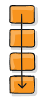
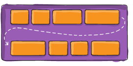
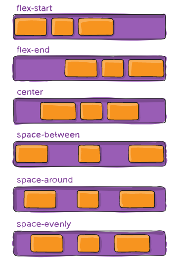
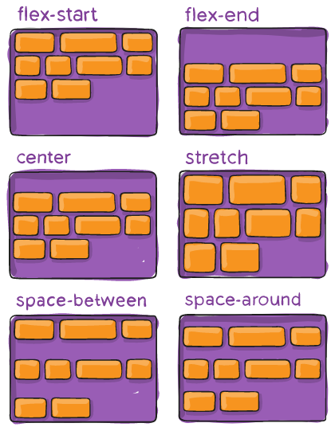
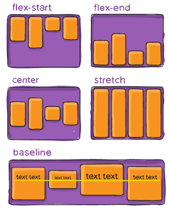

# Table of Contents
- [Table of Contents](#table-of-contents)
- [Flexbox](#flexbox)
  - [`flex-direction`](#flex-direction)
  - [`flex-wrap`](#flex-wrap)
  - [`justify-content`](#justify-content)
  - [`align-content`](#align-content)
  - [`align-items`](#align-items)
  - [`flex-grow`](#flex-grow)
  - [`flex`](#flex)
  - [`margin` and `auto`](#margin-and-auto)
- [Grid](#grid)
- [BEM Rules of Layout](#bem-rules-of-layout)

# Flexbox
[Up](#table-of-contents)

Flex is used to put things horizontally or vertically.

Resources:
- [A Complete Guide to Flexbox](https://css-tricks.com/snippets/css/a-guide-to-flexbox/)
- [Flexbox Layout Cheatsheet. Otra guía rápida de flexbox](https://logongas.es/lib/exe/fetch.php?media=clase:daw:diw:1eval:css_flexbox_layout_cheatsheet.pdf)
- [The Complete CSS Flex Box Tutorial](https://medium.com/@js_tut/the-complete-css-flex-box-tutorial-d17971950bdc)
- [Flexbox - The Animated Tutorial](https://medium.com/@js_tut/flexbox-the-animated-tutorial-8075cbe4c1b2)
- [In CSS Flexbox, why are there no "justify-items" and "justify-self" properties?](https://stackoverflow.com/questions/32551291/in-css-flexbox-why-are-there-no-justify-items-and-justify-self-properties)
- [Flexbox Froggy - A game for learning CSS flexbox](https://flexboxfroggy.com/#es)

We are going to explain flex with the following example:

```html
<div class="l-flex l-flex--direction-row l-flex--justify-content-center">
  <div clas="l-flex__area">Item1</div>
  <div clas="l-flex__area">Item2</div> 
  <div clas="l-flex__area l-flex__area--grow-2 ">Item3</div>
  <div clas="l-flex__area">Item4</div> 
  <div clas="l-flex__area">Item5</div> 
</div>
```
```css
.l-flex {
  display:flex;
}
 
 
.l-flex--direction-row {
  flex-direction:row
}
 
.l-flex--justify-content-center {
  justify-content:center
}
 
.l-flex__area--grow-2 {
  flex-grow:2
}
```

There are two types of elements: the container and the items inside of it.

The container always has `display: flex`.

Another example:

```html
<div class="l-flex l-flex--direction-row l-flex--justify-content-center">
  <div clas="l-flex__area">
   
        <div class="l-flex l-flex--direction-row l-flex--justify-content-center">
          <div clas="l-flex__area"></div>
          <div clas="l-flex__area"></div>         
        </div>
   
  </div>
  <div clas="l-flex__area">Item2</div> 
  <div clas="l-flex__area l-flex__area--grow-2 ">Item3</div>
  <div clas="l-flex__area">Item4</div> 
  <div clas="l-flex__area">Item5</div> 
</div>
```

## `flex-direction`
[Up](#table-of-contents)

- `flex-direction:row`: Items are located horizontally (in one line).


- `flex-direction:column`: Items are located vertically (in one line).

 

## `flex-wrap`
[Up](#table-of-contents)

- `flex-wrap:wrap`: If it does not fit in on the same line, passes to the next one.



## `justify-content`
[Up](#table-of-contents)


- `justify-content:flex-start`: Items are located at the beginning of the container.: Items are located at the beginning of the container.
- `justify-content:flex-end`: Items are located at the end of the container.
- `justify-content:center`: Items are located in the center of the container.
- `justify-content:space-between`: Items are located with the same space between them.
- `justify-content:space-around`: Items are located with the same space around them.
- `justify-content:space-evenly`: Items are located with the same space between them.



## `align-content`
[Up](#table-of-contents)

- `align-content:flex-start`: Items are located at the beginning of the container.
- `align-content:flex-end`: Items are located at the end of the container.
- `align-content:center`: Items are located in the center of the container.
- `align-content:stretch`: Items are located with the same space between them.
- `align-content:space-between`: Items are located with the same space between them.
- `align-content:space-around`: Items are located with the same space around them.



## `align-items`
[Up](#table-of-contents)

- `align-items:flex-start`: Items are located at the beginning of the container.
- `align-items:flex-end`: Items are located at the end of the container.
- `align-items:center`: Items are located in the center of the container.
- `align-items:stretch`: Items are located with the same space between them.
- `align-items:baseline`: Items are located with the same space between them.



## `flex-grow`
[Up](#table-of-contents)

- `flex-grow`: It is used to grow the item. The value is a number. The default value is 0.
  - `flex-grow:0`: The item does not grow.
  - `flex-grow:1`: The item grows.
  - `flex-grow:2`: The item grows twice.
- `flex-shrink`: It is used to shrink the item. The value is a number. The default value is 1.
- `flex-basis`: It is used to set the initial size of the item. The value is a number. The default value is auto.

It is used in the child elements.

## `flex`
[Up](#table-of-contents)

It is used to set the three properties at the same time (grow, shrink & basis). 

The value is a number. 

The default value is 0 1 auto.

It is used inside the child elements.

More information:
- [Understanding flex-grow, flex-shrink, and flex-basis](https://css-tricks.com/understanding-flex-grow-flex-shrink-and-flex-basis/).
- [Diferencia entre flex basis y width](https://www.paradigmadigital.com/dev/diferencia-flex-basis-width/).
- [Guía definitiva de Flexbox (2): Flex basis, flex-grow, flex-shrink](https://ed.team/blog/guia-definitiva-de-flexbox-2-flex-basis-flex-frow-flex-shrink).
- [Las propiedades flex grow, flex-shrink y flex-basis](https://www.desarrollolibre.net/blog/css/las-propiedades-flex-grow-flex-shrink-y-flex-basis).

## `margin` and `auto`
[Up](#table-of-contents)

```html
<div style="display:flex">
  <div >Item1</div>
  <div >Item2</div>
  <div >Item3</div>  
  <div style="margin-left:auto">Item4</div> 
  <div >Item5</div> 
</div>
```

In this example, items 1, 2 and 3 will be aligned to the left, item 4 will be aligned to the right and item 5 will be aligned to the left.

If we want to align item 1, 2 and 3 to the left, item 4 to the center and item 5 to the right, we can use the following code:

```html
<div style="display:flex">
  <div >Item1</div>
  <div >Item2</div>
  <div >Item3</div>  
  <div style="margin-left:auto;margin-right:auto">Item4</div> 
  <div>Item5</div>
</div>
```

More information:
- [The Most Popular Navigation Bars Created With Flexbox](https://medium.com/flexbox-and-grids/the-most-popular-navigation-bars-created-with-flexbox-6c0f59f55686).
- [Understanding Flexbox - auto-margin](https://github.com/ohansemmanuel/Understanding-Flexbox/blob/master/05.%20Auto%20margin%20alignment/auto_margin.md).

# Grid
[Up](#table-of-contents)

# BEM Rules of Layout
[Up](#table-of-contents)

