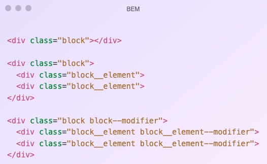

# Table of Contents
- [Table of Contents](#table-of-contents)
- [Layout CSS](#layout-css)
- [Reset CSS](#reset-css)
- [CSS Arquitecture](#css-arquitecture)
- [CSS Preprocessors](#css-preprocessors)
  - [Variables](#variables)
  - [Loops](#loops)
  - [Father Selector](#father-selector)
  - [Using SASS](#using-sass)
- [BEM](#bem)
- [Files Structure](#files-structure)

# Layout CSS
[Up](#table-of-contents)

Grid is a layout system that allows you to create complex layouts with rows and columns. It is a two-dimensional system, meaning it can handle both columns and rows, unlike flexbox which is largely a one-dimensional system.

```css
.contenedor {
                display: grid;
                grid-template-areas:
                  "cabecera cabecera cabecera cabecera cabecera"
                  "lateral-izquierdo cuerpo cuerpo cuerpo lateral-derecho"
                  "pie pie pie pie pie";
            }
 
            .cabecera {
                grid-area: cabecera;
            }
 
            .cuerpo {
                grid-area: cuerpo;
            }
 
            .lateral-izquierdo {
                grid-area: lateral-izquierdo;
            }
 
            .lateral-derecho {
                grid-area: lateral-derecho;
            }
 
            .pie {
                grid-area: pie;
            }
```

With BEM, the classes are going to be like this: _l-piramid.scss, _l-piramid--right, _l-piramid--left and _l-piramid--peak.

# Reset CSS
[Up](#table-of-contents)

Each navigation has its own default styles. The reset is a CSS file that removes all the default styles of the browser.

CSS that we must include:
- [Normalize.css](https://necolas.github.io/normalize.css/)
- [Eric Meyer's Reset CSS 2.0](https://meyerweb.com/eric/tools/css/reset/)

# CSS Arquitecture
[Up](#table-of-contents)

We are going to use BEM (Block Element Modifier) for the CSS architecture. This is a methodology that helps you to create reusable components and code sharing in front-end development.

Objetives:
- Predictable.
- Reusable.
- Maintainable.
- Scalable.



# CSS Preprocessors

SASS is a CSS Preprocessor.

It is like adding functionality to CSS in order it write less.

It aloows loops, functions, variables, etc.

## Variables
    
```scss
    $font-main: Helvetica, sans-serif;
$primary-color: #E4A23F;
 
 
body {
  font-family: $font-main;
  color: $primary-color;
}
```

It will be transformed into:
```css
body {
  font-family: Helvetica, sans-serif;
  color: #E4A23F;
}
```

## Loops

```scss
$colors: (
   "rojo": #FF0000, 
   "verde": #00FF00, 
   "azul": #0000FF
);
 
@each $name, $color in $colors {
  .background-#{$name} {
    background-color: $color;
  }
} 
```

It will be transformed into:

```css
.background-rojo  {  background-color: #FF0000; }
.background-verde {  background-color: #00FF00; }
.background-azul  {  background-color: #0000FF; }
```

## Father Selector

```scss
AAA {
  color:red;
   
  &__BBB {
    padding:5px;
  }
}
````

It will be transformed into:

```css
AAA {
  color:red;
}
AAA__BBB {
  padding:5px;
}
```

## Using SASS

Transform SASS to CSS:
```bash
sass  ./main.scss ./main.css
```

Transform SASS to CSS and watch for changes:
```bash
sass --watch ./main.scss ./main.css
```

This means that if you make any changes to main.scss, SASS will automatically detect the change and recompile the main.css file.

You don't need to run the command manually every time you make a modification.

We can join all the files in one file and then transform it into CSS.
```scss
@import "01_utilities/_css-variables.scss";
@import "01_utilities/_sass-variables.scss";
@import "01_utilities/_functions.scss";
```

# BEM

BEM is a methodology that helps you to create reusable components and code sharing in front-end development.

Parameters:
- Block: The main component.
- Element: A part of the block that has no meaning by itself.
- Modifier: A variation of the block or element.

```html
<div class="block">
  <div class="block__element block__element--modifier"></div>
</div>
```

```scss
.block {
  background-color: red;
}
.block__element {
  background-color: green;
}
.block__element--modifier {
  background-color: blue;
}
```

- -c: for blocks that are visual components.
- -l: for blocks that are layout components.
- -g: for blocks that are global components.

Example:
```html
<body class="c-body">    
    <div class="l-page">
        <div class="l-page__header">
            
            <div class="c-menu">
                <div class="c-menu__item ">Nuevo</div>
                <div class="c-menu__item menu__item--active">Editar</div>
                <div class="c-menu__item menu__item--disable">Borrar</div>
            </div>
        </div>
        <div class="l-page__body">
            <form class="c-form g--margin-4 g--margin-bottom-6">
                <input class="c-input" >
                <input class="c-input" >
                <input class="c-input" >
                <button class="c-button c-button--primary c-button--normal">Guardar</button>
            </form>
        </div>     
        <div class="l-page__footer">
            <div class="l-horizontal">
                
                
                
                
            </div>    
        </div> 
    </div>
</body>
```


# Files Structure
[Up](#table-of-contents)

```
/scss
   /01_utilities
       _css-variables.scss
       _sass-variables.scss
       _functions.scss
       _mixins.scss
  /02_base
      _override.scss
      _reset.scss
      _typography.scss
  /03_layout
      _cada_uno_de_los_layouts.scss
  /04_components
      _cada_uno_de_los_componentes.scss
  /05_pages
      _estilos_especificos_de_una_pagina_concreta.scss
  /06_global
      _cada_una_de_los_modificadores_globales.scss
  main.scss
```

```
/01_utilities
_css-variables.scss: css variables such as colors or margin sizes, etc.
_sass-variables.scss: SASS variables like e.g. colors or margin sizes, etc.
_functions.scss: SASS functions
_mixins.scss: SASS Mixins

/02_base
_override.scss: It is to override CSS of some library that is used.
_reset.scss: The reset that we use
_typography.scss: Things related to typography

/03_layout
_each_of_the_layouts.scss: There will be a file for each Block that is of layout type. For example _l-page.scss

/04_components
each_one_of_the_components.scss: There will be a file for each Block that is of type Component. For example _c-button.scss , _c-panel.scss or _c-body

/05_pages
specific_styles_of_a_concrete_page.scss: If there is css that is specific to a specific page. There should never be anything here.

/06_global
_each_of_the_global_modifiers.scss: There will be a file for each type of modifier there is. For example _g--margin.scss
main.scss: All the SASS code is grouped here and it is the only file that is transformed into CSS.
```